[[法布里·贝拉德]]


支持的CPU架构：x86、[[LoongArch]]……

## 依赖

```dot
digraph G {
    "ffmpeg";
    "aom";
    "jpeg-xl";
    "brotli";
    "giflib";
    "highway";
    "imath";
    "jpeg-turbo";
    "libpng";
    "openexr";
    "webp";
    "libtiff";
    "libvmaf";
    "dav1d";
    "fontconfig";
    "freetype";
    "frei0r";
    "gnutls";
    "ca-certificates";
    "gmp";
    "guile";
    "bdw-gc";
    "libtool";
    "m4";
    "libunistring";
    "pkg-config";
    "readline";
    "libidn2";
    "gettext";
    "libtasn1";
    "nettle";
    "p11-kit";
    "unbound";
    "libevent";
    "openssl@1.1";
    "libnghttp2";
    "lame";
    "libass";
    "fribidi";
    "harfbuzz";
    "cairo";
    "glib";
    "pcre2";
    "libx11";
    "libxcb";
    "libpthread-stubs";
    "libxau";
    "xorgproto";
    "libxdmcp";
    "libxext";
    "libxrender";
    "lzo";
    "pixman";
    "graphite2";
    "icu4c";
    "libbluray";
    "librist";
    "cjson";
    "cmocka";
    "mbedtls";
    "libsoxr";
    "libvidstab";
    "libvorbis";
    "libogg";
    "libvpx";
    "opencore-amr";
    "openjpeg";
    "little-cms2";
    "opus";
    "rav1e";
    "rubberband";
    "libsamplerate";
    "libsndfile";
    "flac";
    "sdl2";
    "snappy";
    "speex";
    "srt";
    "tesseract";
    "leptonica";
    "libarchive";
    "libb2";
    "lz4";
    "xz";
    "zstd";
    "theora";
    "x264";
    "x265";
    "xvid";
    "zeromq";
    "libsodium";
    "zimg";
    "ffmpeg" -> "aom";
    "ffmpeg" -> "dav1d";
    "ffmpeg" -> "fontconfig";
    "ffmpeg" -> "freetype";
    "ffmpeg" -> "frei0r";
    "ffmpeg" -> "gnutls";
    "ffmpeg" -> "lame";
    "ffmpeg" -> "libass";
    "ffmpeg" -> "libbluray";
    "ffmpeg" -> "librist";
    "ffmpeg" -> "libsoxr";
    "ffmpeg" -> "libvidstab";
    "ffmpeg" -> "libvmaf";
    "ffmpeg" -> "libvorbis";
    "ffmpeg" -> "libvpx";
    "ffmpeg" -> "opencore-amr";
    "ffmpeg" -> "openjpeg";
    "ffmpeg" -> "opus";
    "ffmpeg" -> "rav1e";
    "ffmpeg" -> "rubberband";
    "ffmpeg" -> "sdl2";
    "ffmpeg" -> "snappy";
    "ffmpeg" -> "speex";
    "ffmpeg" -> "srt";
    "ffmpeg" -> "tesseract";
    "ffmpeg" -> "theora";
    "ffmpeg" -> "webp";
    "ffmpeg" -> "x264";
    "ffmpeg" -> "x265";
    "ffmpeg" -> "xvid";
    "ffmpeg" -> "xz";
    "ffmpeg" -> "zeromq";
    "ffmpeg" -> "zimg";
    "aom" -> "jpeg-xl";
    "aom" -> "libvmaf";
    "jpeg-xl" -> "brotli";
    "jpeg-xl" -> "giflib";
    "jpeg-xl" -> "highway";
    "jpeg-xl" -> "imath";
    "jpeg-xl" -> "jpeg-turbo";
    "jpeg-xl" -> "libpng";
    "jpeg-xl" -> "openexr";
    "jpeg-xl" -> "webp";
    "openexr" -> "imath";
    "webp" -> "giflib";
    "webp" -> "jpeg-turbo";
    "webp" -> "libpng";
    "webp" -> "libtiff";
    "libtiff" -> "jpeg-turbo";
    "fontconfig" -> "freetype";
    "freetype" -> "libpng";
    "gnutls" -> "ca-certificates";
    "gnutls" -> "gmp";
    "gnutls" -> "guile";
    "gnutls" -> "libidn2";
    "gnutls" -> "libtasn1";
    "gnutls" -> "libunistring";
    "gnutls" -> "nettle";
    "gnutls" -> "p11-kit";
    "gnutls" -> "unbound";
    "guile" -> "bdw-gc";
    "guile" -> "gmp";
    "guile" -> "libtool";
    "guile" -> "libunistring";
    "guile" -> "pkg-config";
    "guile" -> "readline";
    "libtool" -> "m4";
    "libidn2" -> "gettext";
    "libidn2" -> "libunistring";
    "nettle" -> "gmp";
    "p11-kit" -> "ca-certificates";
    "p11-kit" -> "libtasn1";
    "unbound" -> "libevent";
    "unbound" -> "libnghttp2";
    "unbound" -> "openssl@1.1";
    "libevent" -> "openssl@1.1";
    "openssl@1.1" -> "ca-certificates";
    "libass" -> "freetype";
    "libass" -> "fribidi";
    "libass" -> "harfbuzz";
    "harfbuzz" -> "cairo";
    "harfbuzz" -> "freetype";
    "harfbuzz" -> "glib";
    "harfbuzz" -> "graphite2";
    "harfbuzz" -> "icu4c";
    "cairo" -> "fontconfig";
    "cairo" -> "freetype";
    "cairo" -> "glib";
    "cairo" -> "libpng";
    "cairo" -> "libx11";
    "cairo" -> "libxcb";
    "cairo" -> "libxext";
    "cairo" -> "libxrender";
    "cairo" -> "lzo";
    "cairo" -> "pixman";
    "glib" -> "gettext";
    "glib" -> "pcre2";
    "libx11" -> "libxcb";
    "libx11" -> "xorgproto";
    "libxcb" -> "libpthread-stubs";
    "libxcb" -> "libxau";
    "libxcb" -> "libxdmcp";
    "libpthread-stubs" -> "pkg-config";
    "libxau" -> "xorgproto";
    "libxdmcp" -> "xorgproto";
    "libxext" -> "libx11";
    "libxext" -> "xorgproto";
    "libxrender" -> "libx11";
    "libxrender" -> "xorgproto";
    "libbluray" -> "fontconfig";
    "libbluray" -> "freetype";
    "librist" -> "cjson";
    "librist" -> "cmocka";
    "librist" -> "mbedtls";
    "libvorbis" -> "libogg";
    "openjpeg" -> "libpng";
    "openjpeg" -> "libtiff";
    "openjpeg" -> "little-cms2";
    "little-cms2" -> "jpeg-turbo";
    "little-cms2" -> "libtiff";
    "rubberband" -> "libsamplerate";
    "rubberband" -> "libsndfile";
    "libsamplerate" -> "libsndfile";
    "libsndfile" -> "flac";
    "libsndfile" -> "libogg";
    "libsndfile" -> "libvorbis";
    "libsndfile" -> "opus";
    "flac" -> "libogg";
    "speex" -> "libogg";
    "srt" -> "openssl@1.1";
    "tesseract" -> "leptonica";
    "tesseract" -> "libarchive";
    "leptonica" -> "giflib";
    "leptonica" -> "jpeg-turbo";
    "leptonica" -> "libpng";
    "leptonica" -> "libtiff";
    "leptonica" -> "openjpeg";
    "leptonica" -> "webp";
    "libarchive" -> "libb2";
    "libarchive" -> "lz4";
    "libarchive" -> "xz";
    "libarchive" -> "zstd";
    "zstd" -> "lz4";
    "zstd" -> "xz";
    "theora" -> "libogg";
    "theora" -> "libvorbis";
    "zeromq" -> "libsodium";
}
```



## 使用

### 合并 [[M3U8]] 文件

获取所有 TS 文件名

```shell
# 从已下载 TS 文件
ls -v *.ts | grep "[0-9]" | xargs cat > all.ts
# 从 M3U8 文件获取 TS 索引
cat index.m3u8 | grep ".ts" | xargs cat > all.ts
```

```shell
ffmpeg -i all.ts -codec copy -y output.mp4
```

### 格式转换

```shell
ffmpeg -i input_video.mkv -codec copy output_video.mp4

ffmpeg -i in.mp4 -c:v libx265 -crf 26 -c:a copy -progress p.txt out.mp4
```


## 集成

[[LumaFusion]]


a-Shell 中的 FFmpeg


```shell
ffmpeg -version
ffmpeg version n4.4-80-gbf87bdd3f6 Copyright (c) 2000-2021 the FFmpeg dev
elopers
built with Apple clang version 12.0.5 (clang-1205.0.22.11)
configuration: --cc=clang --arch=arm64 --disable-asm --enable-cross-compi
le --enable-pthreads --enable-videotoolbox --disable-audiotoolbox --enabl
e-libfreetype --enable-libzimg --disable-network --disable-debug --disabl
e-gpl --disable-nonfree
libavutil      56. 70.100 / 56. 70.100
libavcodec     58.134.100 / 58.134.100
libavformat    58. 76.100 / 58. 76.100
libavdevice    58. 13.100 / 58. 13.100
libavfilter     7.110.100 /  7.110.100
libswscale      5.  9.100 /  5.  9.100
libswresample   3.  9.100 /  3.  9.100

```


## Misc

[[视频]]

[[视频编辑]]

[FFmpeg 编码和编辑入门 | Asimov](https://asimov.top/archives/ffmpeg-encoding-and-editing-course)

[enzo1982/freac](https://github.com/enzo1982/freac): The fre:ac audio converter project


