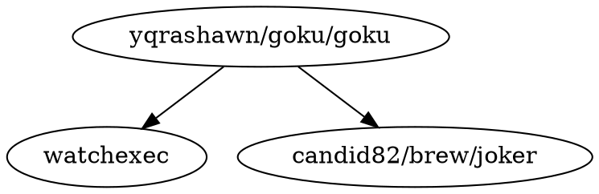

[GokuRakuJoudo](https://github.com/yqrashawn/GokuRakuJoudo)：[[DSL]] for [[Karabiner-Elements]]

配置文件：[[EDN]]

## 依赖

[watchexec/watchexec](https://github.com/watchexec/watchexec): Executes commands in response to file modifications

[candid82/joker](https://github.com/candid82/joker): Small Clojure interpreter, linter and formatter.

## 配置

[fjchen7/dotfiles/karabiner.edn](https://github.com/fjchen7/dotfiles/blob/master/karabiner/karabiner.edn)

[Learn Anything](https://learn-anything.xyz/) 开发者： [nikitavoloboev/dotfiles/karabiner.edn](https://github.com/nikitavoloboev/dotfiles/blob/master/karabiner/karabiner.edn)

Script Kit 开发者：[johnlindquist/dotfiles](https://github.com/johnlindquist/dotfiles)

### [Colemak](https://colemak.com/Mac)

[kiinoda/goku](https://github.com/kiinoda/goku): Goku config to map Mac keyboard to Colemak, w/ extended layer, mod-wide and single-press modifiers as power keys

## Misc

[[Capslock]]

