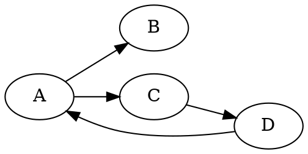

[[编程语言]]：DOT Language

[Graphviz 官网](https://www.graphviz.org/)

[[有向图]]：digraph（direction graph）
[[无向图]]：graph

实体对象：Graph（图）、Node（点/节点）、Edge（节点之间的连线）
图：Graph（图）、Subgraph（子图）、Cluster Subgraph（聚集子图）

## LSP

[nikeee/dot-language-server](https://github.com/nikeee/dot-language-server): A language server for the DOT language

## App

[ruben2020/tags2uml](https://github.com/ruben2020/tags2uml): Generates UML class diagrams, from source code. Command line tool to convert from a Exuberant-ctags tags file to a UML class diagram, through Graphviz DOT, for all object oriented languages supported by [[ctags]]

## 竞品

[[D2]]

## Misc

[[图表]]

[vmiklos/ged2dot](https://github.com/vmiklos/ged2dot): GEDCOM to Graphviz converter

[vrdel/graphviz-mindmaps](https://github.com/vrdel/graphviz-mindmaps): graphviz-mindmaps

[[思维导图]]

