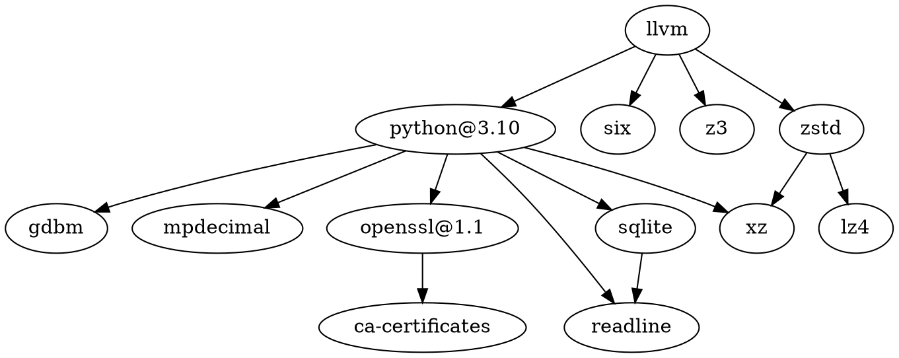

[llvm/llvm-project](https://github.com/llvm/llvm-project): The LLVM Project is a collection of modular and reusable compiler and toolchain technologies. Note: the repository does not accept github pull requests at this moment. Please submit your patches at http://reviews.llvm.org.


## 前端：Clang（GCC）

```shell
# 安装（可只安装 Command Line Tools 而不安装 Xcode）
xcode-select --install
# 默认 clang/gcc 路径
# /Library/Developer/CommandLineTools/usr/bin
# 查看 clang
clang -v
# 输出（安装 Xcode 后的路径）
Apple clang version 14.0.0 (clang-1400.0.29.201)
Target: arm64-apple-darwin22.1.0
Thread model: posix
InstalledDir: /Applications/Xcode-beta.app/Contents/Developer/Toolchains/XcodeDefault.xctoolchain/usr/bin
# 查看 gcc
gcc -v
# 输出（安装 Xcode 后的路径）
Apple clang version 14.0.0 (clang-1400.0.29.201)
Target: arm64-apple-darwin22.1.0
Thread model: posix
InstalledDir: /Applications/Xcode-beta.app/Contents/Developer/Toolchains/XcodeDefault.xctoolchain/usr/bin

```

词法分析
语法分析
语义分析、中间代码生成

## 优化器

代码优化

## 后端

目标程序生成

## 依赖





## Misc

[[LLDB]]

[[clangd]]

