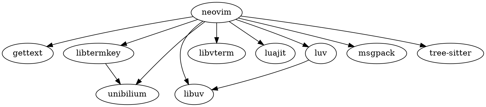

[Home - Neovim](https://neovim.io/)

hyperextensible Vim-based text editor

## 功能/特色

API：C/C++, C#, Clojure, D, Elixir, Go, Haskell, Java, JavaScript/Node.js, Julia, Lisp, Lua, Perl, Python, Racket, Ruby, Rust

[[XDG]]


[[Language Server Protocol]]

[[tree-sitter]]

[[Lua]]：first-class citizen in the Neovim ecosystem

## 版本

```shell
# HEAD installs of Neovim do not include any tree-sitter parsers.
# You can use the `nvim-treesitter` plugin to install them.

NVIM v0.9.0-dev-156+g29fe3348b-dirty
Build type: Release
LuaJIT 2.1.0-beta3
编译者 suliveevil@swy-M1

Features: +acl +iconv +tui
See ":help feature-compile"

     系统 vimrc 文件: "$VIM/sysinit.vim"
         $VIM 预设值: "/opt/homebrew/Cellar/neovim/HEAD-29fe334/share/nvim"

Run :checkhealth for more info
```


## Dependency 依赖

[[gettext]]
libtermkey: Library for processing keyboard entry from the terminal
libuv: Multi-platform support library with a focus on asynchronous I/O
libvterm: C99 library which implements a VT220 or xterm terminal emulator
luajit: Just-In-Time Compiler (JIT) for the Lua programming language
luv: Bare libuv bindings for lua
luajit-openresty
msgpack: Library for a binary-based efficient data interchange format
tree-sitter: Parser generator tool and incremental parsing library
unibilium: Very basic terminfo library

Dependencies when build on macOS
cmake: Cross-platform make
libtool
luarocks: Package manager for the Lua programming language
pkg-config: Manage compile and link flags for libraries





## 安装


macOS Homebrew：

```shell
# https://github.com/Homebrew/homebrew-core/blob/master/Formula/neovim.rb
# 安装稳定版
brew install neovim
# 安装先行版
brew install  --HEAD neovim # brew install neovim --HEAD
# 更新
brew reinstall neovim
```


[austinliuigi/brew-neovim-nightly](https://github.com/austinliuigi/brew-neovim-nightly): Homebrew tap for neovim nightly

nightly
1. Download **nvim-macos.tar.gz**
2. Run `xattr -c ./nvim-macos.tar.gz` (to avoid "unknown developer" warning)
3. Extract: `tar xzvf nvim-macos.tar.gz`
4. Run `./nvim-macos/bin/nvim`

## 客户端

[[VimR]]

[[neovide]]

[vv-vim/vv](https://github.com/vv-vim/vv): Neovim client for macOS

[akiyosi/goneovim](https://github.com/akiyosi/goneovim): Neovim GUI written in Golang, using a Golang qt backend

[yatli/fvim](https://github.com/yatli/fvim): Cross-platform Neovim front-end UI, built with F# + Avalonia


[beeender/glrnvim](https://github.com/beeender/glrnvim): glrnvim wraps nvim with your favourite terminal into a standalone, non-fancy but daily-usable neovim GUI.


[RMichelsen/Nvy](https://github.com/RMichelsen/Nvy): Nvy - A Neovim client for Windows in C++


## [[Neovim 插件]]

[neovimcraft](https://neovimcraft.com/)

[rockerBOO/awesome-neovim: Collections of awesome neovim plugins.](https://github.com/rockerBOO/awesome-neovim)

[[nvim-libmodal]]

[[Neorg]]

[Iron-E/nvim-cartographer](https://github.com/Iron-E/nvim-cartographer): Create Neovim `:map`pings in Lua with ease!
Simplify Neovim API

### 包管理器/插件管理器

[[packer.nvim]]

[williamboman/mason.nvim](https://github.com/williamboman/mason.nvim): Portable package manager for Neovim that runs everywhere Neovim runs. Easily install and manage LSP servers, DAP servers, linters, and formatters.

[MordechaiHadad/bob](https://github.com/MordechaiHadad/bob): A version manager for neovim


## [[Neovim 配置]]


## 兄弟产品

[[nvimdev.nvim]]


## 竞品 app

[[Vim]]

[[Emacs]]


## Misc

[nanotee/nvim-lua-guide](https://github.com/nanotee/nvim-lua-guide): A guide to using Lua in Neovim

[glepnir/nvim-lua-guide-zh](https://github.com/glepnir/nvim-lua-guide-zh)

[rockerBOO/awesome-neovim](https://github.com/rockerBOO/awesome-neovim): Collections of awesome Neovim plugins.

[mhinz/neovim-remote: Support for --remote and friends.](https://github.com/mhinz/neovim-remote)

[noib3/nvim-oxi](https://github.com/noib3/nvim-oxi): Rust bindings to all things Neovim


