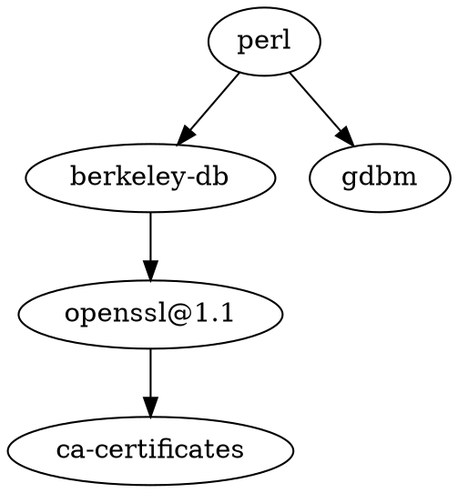

Perl 语言的发明人 Larry Wall 说，好的程序员有3种美德： 懒惰、急躁和傲慢(Laziness, Impatience and Hubris)。

```bash
perl --version

This is perl 5, version 30, subversion 3 (v5.30.3) built for darwin-thread-multi-2level
(with 2 registered patches, see perl -V for more detail)

Copyright 1987-2020, Larry Wall

Perl may be copied only under the terms of either the Artistic License or the
GNU General Public License, which may be found in the Perl 5 source kit.

Complete documentation for Perl, including FAQ lists, should be found on
this system using "man perl" or "perldoc perl".  If you have access to the
Internet, point your browser at http://www.perl.org/, the Perl Home Page.
```


## 依赖

[[berkeley-db]]





## Misc

[[Racket]]

[[awk]]

[[sed]]


