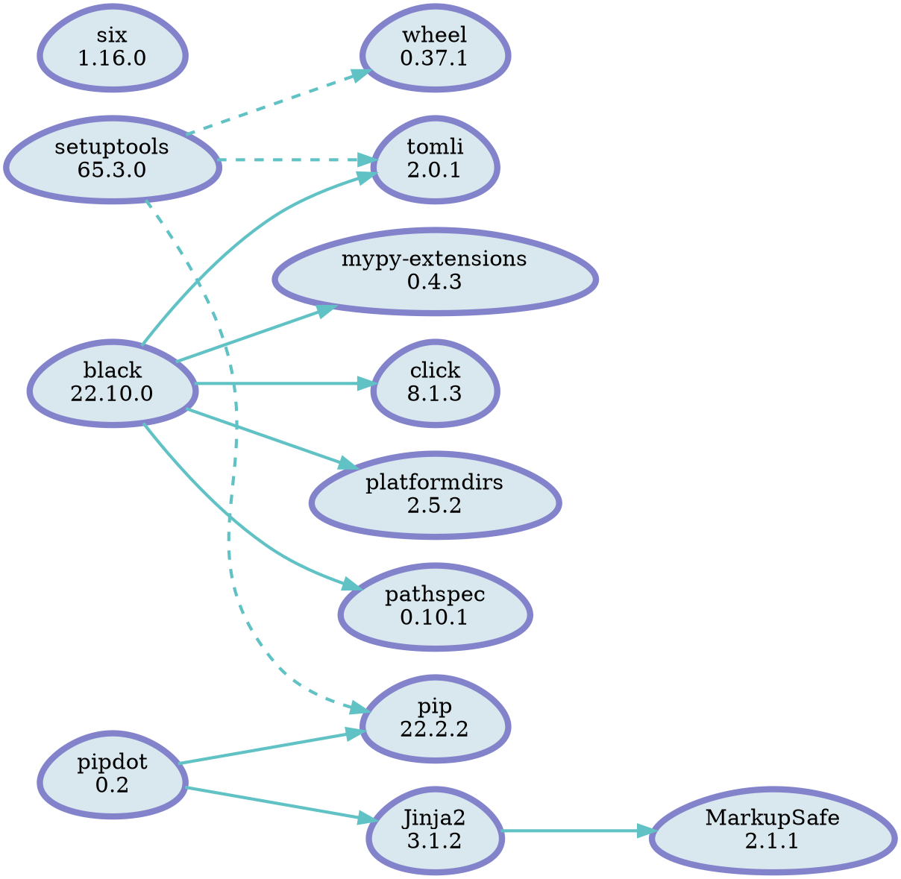

[tanbro/pipdot](https://github.com/tanbro/pipdot): Generate a [[Graphviz]] dot file representing installed PyPI distributions


```shell
# 安装
pip3 install pipdot
```

```shell
# 帮助文档
python3 -m pipdot --help

usage: /opt/homebrew/opt/python@3.10/bin/python3.10 -m pipdot
       [-h] [--version] [--path PATH] [--local-only | --no-local-only]
       [--include-editables | --no-include-editables]
       [--editables-only | --no-editables-only] [--user-only | --no-user-only]
       [--show-extras-label | --no-show-extras-label]
       [--installed-only | --no-installed-only] [--template TEMPLATE]
       [output]

Generate a GraphViz dot file representing installed PyPI distributions

positional arguments:
  output                Write generated graphviz dot to the file. It will
                        output to "stdout" if not specified.

options:
  -h, --help            show this help message and exit
  --version, -V         show program's version number and exit
  --path PATH, -p PATH  If path is set, only report the distributions present
                        at the specified location. This option can be
                        specified multiple times for more than one locations.
  --local-only, --no-local-only
                        If in a virtual-env that has global access, do not
                        list globally-installed packages. (default: True)
  --include-editables, --no-include-editables
                        List editable projects. (default: True)
  --editables-only, --no-editables-only
                        List editable projects only. (default: False)
  --user-only, --no-user-only
                        Only output packages installed in user-site. (default:
                        False)
  --show-extras-label, --no-show-extras-label
                        Show extras dependencies label. (default: False)
  --installed-only, --no-installed-only
                        Only output installed packages. Extras packages those
                        are not installed will not be shown. (default: True)
  --template TEMPLATE, -t TEMPLATE
                        The Jinja2 template file be used to render GraphViz.
                        If not specified, a default template will be used.

```





## 竞品

pip-audit

## Misc


[[Python]]


