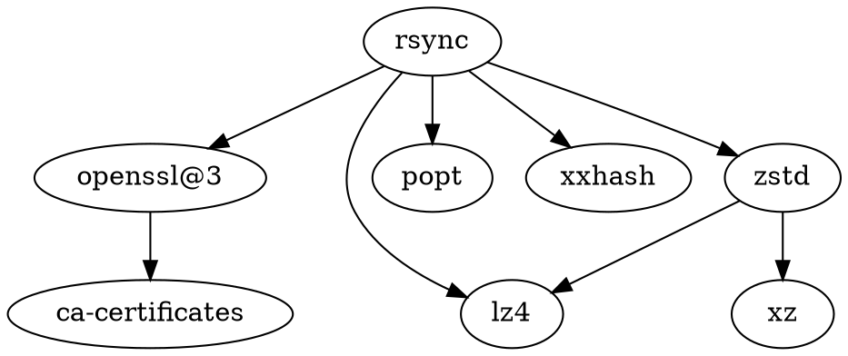

[WayneD/rsync](https://github.com/WayneD/rsync): An open source utility that provides fast incremental file transfer. It also has useful features for backup and restore operations among many other use cases.

官网：[rsync](https://rsync.samba.org/)

## 算法

差分算法

## 依赖

## Misc

[[Git]]

[[SSH]]

[[RFC]]

