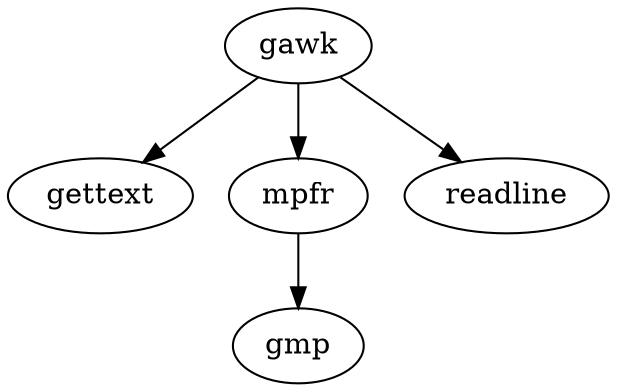

强项：数据切片、数据格式化，对文本进行较为复杂的格式处理
1977年诞生于贝尔实验室

## 简介

awk其名称得自于它的创始人 Alfred Aho 、Peter Weinberger 和 Brian Kernighan 姓氏的首个字母。实际上 AWK 的确拥有自己的语言： AWK 程序设计语言 ， 三位创建者已将它正式定义为“样式扫描和处理语言”。它允许您创建简短的程序，这些程序读取输入文件、为数据排序、处理数据、对输入执行计算以及生成报表，还有无数其他的功能。

awk 是一种很棒的语言，它适合文本处理和报表生成，其语法较为常见，借鉴了某些语言的一些精华，如 C 语言等。在 linux 系统日常处理工作中，发挥很重要的作用，掌握了 awk将会使你的工作变的高大上。 awk 是三剑客（awk、[[sed]]、[[grep]]）的老大，利剑出鞘，必会不同凡响。

## 版本

gawk：[[GNU]] awk
手册：[The GNU Awk User’s Guide](https://www.gnu.org/software/gawk/manual/gawk.html)
awk：BSD awk


## 书籍

Sed & Awk 101 Hacks

The AWK Programming Language

- [wuzhouhui/awk](https://github.com/wuzhouhui/awk): AWK 程序设计语言（awk book）中文翻译, LaTeX 排版
- [AWK程序设计语言](https://awk.readthedocs.io/en/latest/index.html)


[AWK实战指南](https://book.saubcy.com/AwkInAction/)


### 依赖




## 使用

```bash
awk '{pattern + action}'` `{filenames}
```

尽管操作可能会很复杂，但语法总是这样，其中 pattern 表示 AWK 在数据中查找的内容，而 action 是在找到匹配内容时所执行的一系列命令。花括号（{}）不需要在程序中始终出现，但它们用于根据特定的模式对一系列指令进行分组。 pattern就是要表示的正则表达式，用斜杠括起来。

awk语言的最基本功能是在文件或者字符串中基于指定规则浏览和抽取信息，awk抽取信息后，才能进行其他文本操作。完整的awk脚本通常用来格式化文本文件中的信息。

通常，awk是以文件的一行为处理单位的。awk每接收文件的一行，然后执行相应的命令，来处理文本。

## LSP

[Beaglefoot/awk-language-server](https://github.com/Beaglefoot/awk-language-server): Language Server for AWK and associated VSCode client extension


## Misc

[Beaglefoot/tree-sitter-awk](https://github.com/Beaglefoot/tree-sitter-awk): GNU AWK grammar for [[tree-sitter]]


