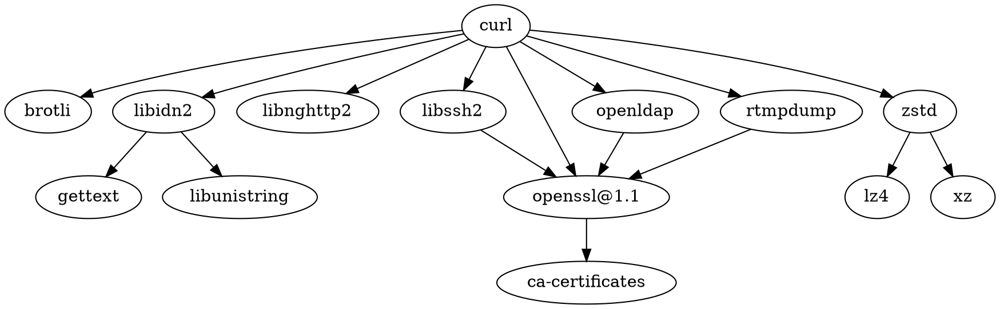

[curl/curl](https://github.com/curl/curl): A command line tool and library for transferring data with URL syntax, supporting DICT, FILE, FTP, FTPS, GOPHER, GOPHERS, HTTP, HTTPS, IMAP, IMAPS, LDAP, LDAPS, MQTT, POP3, POP3S, RTMP, RTMPS, RTSP, SCP, SFTP, SMB, SMBS, SMTP, SMTPS, TELNET and TFTP. libcurl offers a myriad of powerful features.

cURL 是一个网络数据传输项目，通常说 cURL 是指   curl 命令行工具，它支持 DICT、FILE、FTP、FTPS、Gopher、[[HTTP]]、HTTPS、IMAP、IMAPS、LDAP、LDAPS、POP3、POP3S、RTMP、RTSP、SCP、SFTP、SMB、SMBS、SMTP、SMTPS、Telnet 与   TFTP 等协议，而 curl 的底层使用的是 libcurl 库，libcurl 与   curl 组成了 cURL 项目。

## 依赖

## 竞品

httpie

## Misc

[curlconverter/curlconverter](https://github.com/curlconverter/curlconverter): Convert cURL commands to Python, JavaScript, Java, C#, PHP, Go, Dart, R, Ruby, Rust, MATLAB, Elixir, CFML, Ansible, Strest or JSON

[[top]]

