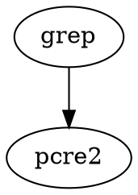

Global Regular Expression Print：`g/Regular Expression/p`
Linux 三剑客（[[awk]]、[[sed]]、grep）之一
强项：数据搜索查找匹配定位

## 标准

POSIX：
BRE（Basic Regular Expressions）：[[001软件/grep]]、[[001软件/sed]]、[[Vim]]
ERE（Extended Regular Expressions）：[[001软件/awk]]、[[Emacs]]

PCRE：[[C]]、[[Python]]、[[Ruby]]、[[PHP]]


## 实现

BSD grep

[[GNU]] grep：使用 Boyer-Moore [[算法]]

[singe/singrep](https://github.com/singe/singrep): singe's grep - a fast grep using single-file parallelism

### 依赖

[[PCRE]]




## help


```bash
# grep 中文翻译

文件模式搜索：
	grep, egrep, fgrep, zgrep, zegrep, zfgrep
 
上述几个命令的区别：
	grep - 简单模式以及基本的正则
	egrep - 扩展的正则
	fgrep - 比grep和egrep都快，只进行 '字符串匹配'
	zgrep, zegrep, zfgrep 和 grep, egrep, fgrep 类似，唯一区别是：z系列grep，支持压缩文件的搜索(compress, gzip)
 
命令格式：
	grep [-abcdDEFGHhIiJLlmnOopqRSsUVvwxZ] [-A num] [-B num] [-C[num]] [-e pattern] [-f file] [--binary-files=value] [--color[=when]] [--colour[=when]] [--context[=num]] [--label] [--line-buffered] [--null] [pattern] [file ...]
 
命令选项：
	1.-A num		// 除了搜索到的行，还显示该行后面的几行
		--after-context=num
	2.-B num		// 除了搜索到的行，还显示该行前面的几行
		--before-context=num
	3.-C num		// 除了搜索到的行，还显示该行前面和后面的几行。默认值是2.
		--context=num
 
	4.-a 			// 将所有文件当做二进制文件。默认，如果文件包含二进制字符，grep将会输出 'Binary file ... matches'。使用这个参数，对二进制文件也进行匹配搜索
		--text
	5.-b 			// 匹配到的字符串，在当前匹配行的字节偏移，写在最前面
		--byte-offset
	6.-c 			// 输出匹配到的行个数
		--count
	7.--color[=when]	// 对匹配的内容，添加颜色，颜色采用 'GREP_COLOR' 环境变量。when-什么时候给内容添加颜色，可选的值有：never, always, auto。
		--colour[=when]
	8.-D action		// 当我们搜索的文件是设备时，例如：FIFO、Socket，使用该选项来指定处理行为。默认的action是 'read'，代表，把这些设备当做普通文件来读取；设置为 'skip'，则跳过这些设备文件。
		--devices=action
	9.-d action 	// 当我们搜索的文件是目录时，使用该选项来指定处理行为。默认的action是 'read'，当做普通文件读取；设置为 'skip'，则忽略目录的搜索；设置为 'recurse'，表示递归搜索目录下的所有文件，等同于 '-R' 或 '-r' 目录。
		--directories=action
	10.-E 			// 使用 '扩展的正则'，等同于 'egrep'
		--extended-regexp
	11.-e pattern	// 指定搜索时使用的模式匹配。只要匹配到指定模式的任何一个即可。当使用多个 '-e' 选项时，非常有用！(模式好像也可以直接以 '-' 开头，例如：-dongxuemin)
		--regexp=pattern
 
	12.--include
	13.--exclude
		包含或排除指定的文件，--exclude优先于--include，先排除，后包含。模式匹配的是指定文件的完整路径，而不是文件名部分
 
	14.--include-dir
	15.--exclude-dir
		包含或排除指定的目录，--exclude-dir优先于--include-dir，先排除，后包含。如果使用了 '-R' 选项，则递归包含或排除所有的问题。
 
	16.-F 			// 只进行 '字符串匹配'，等同于 'fgrep'
		--fixed-strings
	17.-f file 		// 从文件中，读取一个或多个换行符分割的模式。空行模式匹配到所有行。换行符不作为模式的一部分。如果文件为空，不会匹配到任何内容。
		--file=file
 
	18.-G 			// 使用 '基本的正则'，等同于 '将grep当做传统的grep'(这点不太懂...)
		--basic-regexp
	19.-H 			// 同时输出匹配内容所在的文件名。如果指定了多个搜索文件，该行为默认
	20.-h 			// 从不输出匹配内容所在的文件名。
		--no-filename
 
	21.-I 			// 忽略二进制文件。该选项等同于 '--binary-file=without-match' 选项
	22.-i 			// 忽略大小写敏感。默认是 '大小写敏感'
		--ignore-case
 
	23.-J 			// 在搜索前，解压缩 'bzip2' 压缩的文件
		--bz2decompress
 
	24.-L 			// 只输出未匹配到内容的文件名。
		--files-without-match
	25.-l 			// 不输出匹配到内容的行，只输出匹配到内容的文件。一旦某个文件已搜索到一个内容，就不继续搜索该文件之后的内容，这样可以节省点效率(因为本身就是只得到文件名，已经获取到了)。如果搜索的是 '标准输入'，则显示 'standard input'
		--files-with-matches
 
	26.--mmap 		// 使用 'mmap' 替代 'read' 来读取输入，在某些情况下，可以获得更好的性能，但是可能会产生不确定的行为。
	27.-m num 		// 设置最大匹配个数，一旦搜索到最大个数，则停止读取文件
		--max-count=num
	28.-n 			// 每个输出行之前，都展示文件中的相对行号，从第1行开始。对于处理的每个文件，都会重置行号计数器。如果指定了-c, -L, -l 或-q 选项，则忽略该选项。
		--line-number
	29.--null 		// 在输出文件名时，使用"\0"放在文件名后，这会替换原本使用的字符，如换行符或冒号。例如"grep -lZ"输出的每个文件都在同一行而不是分行，"grep -HZ"使得文件名后没有冒号
	30.-O 			// 如果指定了 '-R' 选项，只有在命令行上显示列出了 '符号链接'，才会搜索他们。默认是不会搜索符号链接文件的。
	31.-o 			// 输出被匹配到的字符串，而不是输出整行。每个被匹配到的字符串都使用单独的行输出
		--only-matching
	32.-p 			// 如果指定了 '-R' 选项，将不会对符号链接进行搜索。这是默认行为。
	33.-q 			// 静默模式：不输出任何内容。一旦搜索到匹配内容，立即停止。(不太理解)
		--quiet
		--silent
	34.-R 			// 递归搜索子目录
		-r
		--recursice
 
	35.-S 			// 如果指定了 '-R' 选项，将搜索所有的符号链接文件。默认不搜索符号链接文件
	36.-s 			// 静默模式。不存在或不可读的文件，被忽略。(错误消息也不会说出)
		--no-message
	37.-U 			// 搜索二进制文件，但不尝试打印他们
		--binary
	38.-V 			// 显示版本信息并退出
		--version
	39.-v 			// 反转匹配结果，选择那些未匹配到的行
		--invert-match
	40.-w 			// 精确匹配整个单词。单词的组成字符包括：字母、数字和下划线。就好像模式匹配两边添加了 "[[:<:]]" 和 "[[:>:]]"
		--word-regexp
	41.-x 			// 仅选择能精确匹配整行内容的行
		--line-regexp
	42.-y 			// 等同于 '-i' 选项，旧版
	43.-Z 			// 等同于 'zgrep'
		-z
		--decompress
	44.--binary-files=value 	// 控制搜索和打印二进制文件。可选值有：binary(默认) - 搜索二进制文件，但是不打印；without-match：不搜索二进制文件；text：把二进制文件当做普通文件看待。
	45.--line-buffered 			// 强制输出为行缓冲。默认情况下，当标准输出为终端时，输出是行缓冲的，否则块将被缓冲(例如：输出到文件)。
 
	如果没有指定搜索文件参数，则使用标准输入!
 
环境变量：
	GREP_OPTIONS - 可以指定默认参数，会默认填充到命令的参数列表的最前面。不支持 '\' 反斜线转义(不同于 GNU grep)
 
退出状态码：
	0 - 匹配到一行或多行内容
	1 - 未匹配到内容
	2 - 发生错误
 
好的东西当然要分享了，有个哥们对这几个linux命令的翻译，可参考：
	http://www.cnblogs.com/f-ck-need-u/p/7048359.html#mytranslations
```


## 依赖

[[PCRE]]


## 竞品

[[ripgrep]]


## Misc

[[find]]

[[PDF]]：pdfgrep

[[JSON]]：gron

[baohaojun/beagrep](https://github.com/baohaojun/beagrep): Grep 2G source code in 0.23 second.


