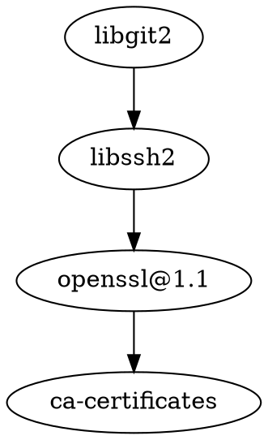

[libgit2/libgit2](https://github.com/libgit2/libgit2): A cross-platform, linkable library implementation of Git that you can use in your application.

## Misc

[[a-Shell]]

[[Git]]

[[dulwich]]

[[isomorphic-git]]

[go-git/go-git](https://github.com/go-git/go-git): A highly extensible Git implementation in pure Go.

[Byron/gitoxide](https://github.com/Byron/gitoxide): An idiomatic, lean, fast & safe pure Rust implementation of Git

[chrisdickinson/git-rs](https://github.com/chrisdickinson/git-rs): git, implemented in rust, for fun and education

[samrat/rug](https://github.com/samrat/rug): A stripped-down version of Git, implemented in Rust

