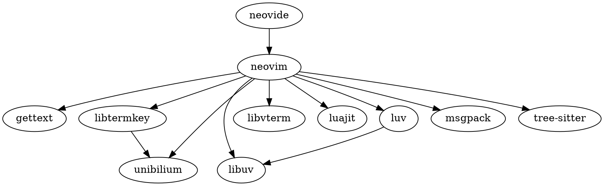

[neovide](https://github.com/neovide/neovide): No Nonsense [[Neovim]] Client in Rust

使用系统安装的 Neovim

```dot
digraph G {
    "neovide";
    "neovim";
    "gettext";
    "libtermkey";
    "unibilium";
    "libuv";
    "libvterm";
    "luajit";
    "luv";
    "msgpack";
    "tree-sitter";
    "neovide" -> "neovim";
    "neovim" -> "gettext";
    "neovim" -> "libtermkey";
    "neovim" -> "libuv";
    "neovim" -> "libvterm";
    "neovim" -> "luajit";
    "neovim" -> "luv";
    "neovim" -> "msgpack";
    "neovim" -> "tree-sitter";
    "neovim" -> "unibilium";
    "libtermkey" -> "unibilium";
    "luv" -> "libuv";
}
```

## 竞品

[[VimR]]

## Misc

