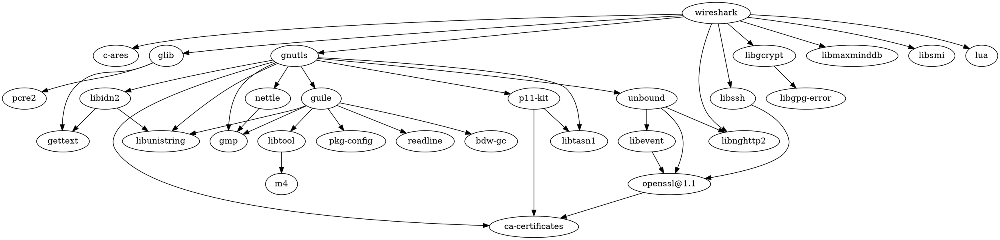

[Wireshark · Go Deep.](https://www.wireshark.org)
Wireshark is the world’s foremost and widely-used network protocol analyzer. It lets you see what’s happening on your network at a microscopic level and is the de facto (and often de jure) standard across many commercial and non-profit enterprises, government agencies, and educational institutions. Wireshark development thrives thanks to the volunteer contributions of networking experts around the globe and is the continuation of a project started by Gerald Combs in 1998.

## 安装

[macos中安装wireshark | 威格灵](http://www.gaohaiyan.com/2674.html)

```shell
sudo chmod 777 /dev/bpf*
```


## 过滤器

### 捕捉过滤器

只捕捉符合过滤规则的封包，在捕捉前设置

### 过滤公式

#### Protocol(协议)

`ether`, `fddi`, `ip`, `arp`, `rarp`, `decnet`, `lat`, `sca`, `moprc`, `mopdl`, `tcp`

#### Direction

`src`,`dst`,`src and dst`,`src or dst`

#### Host(s)

`net`,`port`,`host`,`portrange`

#### Logical Operations

`not`,`and`,`or`

#### 案例
```
//显示目的TCP端口为3128的封包。
tcp dst port 3128

//显示来源IP地址为10.1.1.1的封包。
ip src host 10.1.1.1

//显示目的或来源IP地址为10.1.2.3的封包。
host 10.1.2.3

//显示来源为UDP或TCP，并且端口号在2000至2500范围内的封包。
src portrange 2000-2500

//显示除了icmp以外的所有封包。（icmp通常被ping工具使用）
not imcp

//显示来源IP地址为10.7.2.12，但目的地不是10.200.0.0/16的封包。
src host 10.7.2.12 and not dst net 10.200.0.0/16

//显示来源IP为10.4.1.12或者来源网络为10.6.0.0/16，目的地TCP端口号在200至10000之间，并且目的位于网络10.0.0.0/8内的所有封包。
(src host 10.4.1.12 or src net 10.6.0.0/16) and tcp dst portrange 200-10000 and dst net 10.0.0.0/8

//显示目的TCP端口为3128的封包。
tcp dst port 3128`

//显示来源IP地址为10.1.1.1的封包。
ip src host 10.1.1.1

//显示目的或来源IP地址为10.1.2.3的封包。
host 10.1.2.3

//显示来源为UDP或TCP，并且端口号在2000至2500范围内的封包。
src portrange 2000-2500

//显示除了icmp以外的所有封包。（icmp通常被ping工具使用）
not imcp

//显示来源IP地址为10.7.2.12，但目的地不是10.200.0.0/16的封包。
src host 10.7.2.12 and not dst net 10.200.0.0/16
```

---


### 显示过滤器

用来过滤抓取后的结果，可以随意更改过滤规则

### 过滤公式


## 抓包

### HTTP

#### 1 开启捕捉任务

#### 2 浏览器访问目标网站（查询目标网站ip地址备用）

#### 3 停止捕捉任务

#### 4 设置显示过滤条件

在显示过滤器中输入：

```bash
http and ip.addr == xxx.xxx.xxx.xxx
```

按下回车键后，显示两个数据包：请求包、响应包

#### 5 查看HTTP报文

在任意数据包上右键，追踪流➡️HTTP流

弹出窗口中内容即是完整的HTTP报文

- 红色字体为HTTP请求报文

- 蓝色字体为HTTP响应报文


### UDP

### TCP

## 依赖



## 参考资料

[【网络学习笔记】使用Wireshark抓取HTTP报文](http://www.imooc.com/article/74915?block_id=tuijian_wz)

[【网络学习笔记】使用Wireshark抓取HTTP报文-正阳笔记](http://www.lizhengyang.cn/article/11)


## Misc


[[Fiddler]]

Charles


