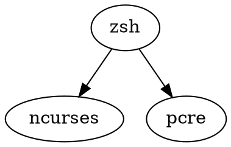

官网：[Zsh](https://www.zsh.org/) GitHub Mirror：[zsh-users/zsh](https://github.com/zsh-users/zsh)


[unixorn/awesome-zsh-plugins](https://github.com/unixorn/awesome-zsh-plugins): A collection of ZSH frameworks, plugins, themes and tutorials.


## 系统自带 zsh

```bash
zsh --version

zsh 5.3 (x86_64-apple-darwin18.0)
```

## 设置 zsh 为默认 shell

```shell
whereis shell
chsh -s /bin/zsh
```


## 依赖

[[ncurses]]

[[PCRE]]




## 插件框架/包管理器

[[zimfw]]

[zdharma-continuum/zinit](https://github.com/zdharma-continuum/zinit): 🌻 Flexible and fast ZSH plugin manager

[z-shell/zi](https://github.com/z-shell/zi): ✨ A Swiss Army Knife for Zsh - Unix Shell

[mattmc3/zsh_unplugged](https://github.com/mattmc3/zsh_unplugged): 🤔 perhaps you don't need a Zsh plugin manager after all...

[zsh_unplugged config - 404cn/dotfiles](https://github.com/404cn/dotfiles/blob/main/.zshrc)

[[zsh-snap]]

[[ohmyzsh]]

[sorin-ionescu/prezto: The configuration framework for Zsh](https://github.com/sorin-ionescu/prezto)

[zplug/zplug: A next-generation plugin manager for zsh](https://github.com/zplug/zplug)

[zsh-users/antigen: The plugin manager for zsh.](https://github.com/zsh-users/antigen)

## 插件

[[zsh-autocomplete]]

[[zsh-completions]]

[[spaceship-prompt]]


```shell
To activate Spaceship, add the following line to ~/.zshrc:

  source "/opt/homebrew/opt/spaceship/spaceship.zsh"

If your .zshrc sets ZSH_THEME, remove that line.
```

[[zsh-autosuggestions]]

[[zsh-syntax-highlighting]]

zsh-256color

```shell
cd $ZSH_CUSTOM/plugins && git clone https://github.com/chrissicool/zsh-256color
```

autoupdate

```shell
git clone https://github.com/TamCore/autoupdate-oh-my-zsh-plugins ~/.oh-my-zsh/custom/plugins/autoupdate
```


### 主题

[Starship: Cross-Shell Prompt](https://starship.rs/)


## 配置

[unixorn/zsh-quickstart-kit](https://github.com/unixorn/zsh-quickstart-kit): A simple ZSH quickstart for using ZSH, zgenom, oh-my-zsh and a curated list of extra plugins. It is designed to be easy to customize without requiring you to maintain your own fork.


## 联动

[[z.lua]]


## 竞品

[[Bash]]

[[FishShell]]

[[PowerShell]]

[[nushell]]


## 历史

Paul Falstad 开发，使用邵中教授的 login-id 命名


## Misc

[Zsh Tips, Tricks , Cheatsheet and Examples by zzapper](http://www.zzapper.co.uk/zshtips.html)


[不优化，zsh 也超快 - 流水沉微](https://shuxiao.wang/posts/zsh-refresh/)

[Minimalistic, powerful and extremely customizable Zsh prompt - Spaceship](https://spaceship-prompt.sh/)

```shell
To activate Spaceship, add the following line to ~/.zshrc:
  source "/opt/homebrew/opt/spaceship/spaceship.zsh"
If your .zshrc sets ZSH_THEME, remove that line.
```


