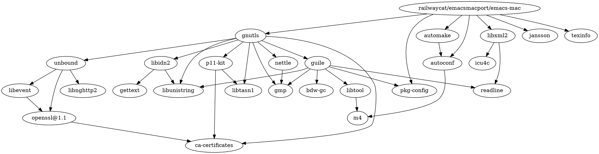

[railwaycat/homebrew-emacsmacport](https://github.com/railwaycat/homebrew-emacsmacport): Emacs mac port formulae for the Homebrew package manager

## 功能

支持三指查词

高清晰度照片支持

像素级滚动（Pixel-based mouse wheel smooth scroll）

Apple event sending with (a)synchronous reply handling

Click in the scroll bar to: Jump to the spot that's clicked

Change of text smoothing threshold setting in the Appearance pane of the System Preferences is reflected immediately

Several keyboard shortcuts (notably those for Keyboard Navigation) listed in System Preferences just work like other applications.

Use non-integral x positions for displaying antialiased proportional fonts.


```shell
brew tap railwaycat/emacsmacport
brew install emacs-mac
# 可选项（功能）
--with-ctags # Don't remove the ctags executable that emacs provides
--with-dbus
--with-glib
--with-imagemagick
--with-mac-metal # use Metal framework in application-side double buffering (experimental)
--with-native-comp # Build with native compilation
--with-natural-title-bar # Build with a patch for title bar color inferred by theme (not recommended to use with --HEAD option)
--with-no-title-bars # Build with a patch for no title bars on frames (not recommended to use with --HEAD option)
--with-librsvg
--with-starter # Build with a starter script to start emacs GUI from CLI
--with-xwidgets # Build with xwidgets

# 可选项（图标）

# 可禁用
--without-modules # Build without dynamic modules support
--without-jansson # Build without jansson support
--without-libxml2 # Build without libxml2 support


# 示例
brew install railwaycat/emacsmacport/emacs-mac --with-ctags --with-dbus --with-glib --with-imagemagick --with-mac-metal --with-no-title-bar --with-librsvg --with-starter --with-xwidgets

```


```shell
brew link --overwrite emacs-mac
# ln -s /opt/homebrew/opt/emacs-mac/Emacs.app /Applications
osascript -e 'tell application "Finder" to make alias file to POSIX file "/opt/homebrew/opt/emacs-mac/Emacs.app" at POSIX file "/Applications"'
```

```shell
This is YAMAMOTO Mitsuharu's "Mac port" addition to
GNU Emacs 28. This provides a native GUI support for Mac OS X
10.10 - 12. After installing, see README-mac and NEWS-mac
in /opt/homebrew/opt/emacs-mac for the port details.

Emacs.app was installed to:
  /opt/homebrew/opt/emacs-mac

To link the application to default Homebrew App location:
  osascript -e 'tell application "Finder" to make alias file to POSIX file "/opt/homebrew/opt/emacs-mac/Emacs.app" at POSIX file "/Applications"'
You can use ln -s, but symlinks created this way don't show up in Spotlight:
  ln -s /opt/homebrew/opt/emacs-mac/Emacs.app /Applications

If you are using Doom Emacs, be sure to run doom sync:
  ~/.emacs.d/bin/doom sync

For an Emacs.app CLI starter, see:
  https://gist.github.com/4043945

Emacs mac port also available on MacPorts with name "emacs-mac-app" and "emacs-mac-app-devel", but they are not maintained by the maintainer of this formula.
```


## 依赖

```shell
brew graph railwaycat/emacsmacport/emacs-mac
```





## Misc

[[Emacs-plus]]


[[emacs-head]]


