[d12frosted/homebrew-emacs-plus](https://github.com/d12frosted/homebrew-emacs-plus): Emacs Plus formulae for the Homebrew package manager


## 安装


```shell
# 安装
brew tap d12frosted/emacs-plus
brew install emacs-plus
brew install emacs-plus@29
brew install emacs-plus@28
brew install emacs-plus@27
brew install emacs-plus@26
# 默认开启的选项
--with-cocoa
--with-gnutls
--with-librsvg
--with-little-cms2
--with-libxml2
--with-modules          # dynamic modules

# 可选项/功能
--with-ctags            # don’t remove the ctags executable that Emacs provides
--with-compress-install # Build with compressed install optimization
--with-dbus             # build with dbus support
--with-debug            # build with debug symbols and debugger friendly optimizations
--with-imagemagick      # not included by default with emacs-plus@29
--with-mailutils        # build with mailutils support
--with-native-comp      # Build with native compilation
--with-no-frame-refocus # disables frame re-focus (ie. closing one frame does not refocus another one)
--with-poll             # build with poll() instead of select() to enable more file descriptors(cocoa)

# 冲突选项
--with-x11              # build with x11 support, incompatible with xwidgets
--with-xwidgets         # build with xwidgets(webkit) support

# 可关闭选项/功能
--without-cocoa         # build a non-Cocoa version of Emacs (terminal only)

# 过时选项
--with-no-titlebar      # 在 Emacs 29 中弃用

# 安装示例
brew install d12frosted/emacs-plus/emacs-plus@29 --with-dbus --with-debug --with-imagemagick --with-mailutils --with-no-frame-refocus --with-xwidgets


# 重装（不建议使用brew reinstall）
brew uninstall d12frosted/emacs-plus/emacs-plus@29
brew install d12frosted/emacs-plus/emacs-plus@29
```

```shell
Emacs.app was installed to:
  /opt/homebrew/opt/emacs-plus@28

To link the application to default Homebrew App location:
  ln -s /opt/homebrew/opt/emacs-plus@28/Emacs.app /Applications

osascript -e 'tell application "Finder" to make alias file to posix file "/opt/homebrew/opt/emacs-plus@29/Emacs.app" at POSIX file "/Applications"'

Your PATH value was injected into Emacs.app/Contents/Info.plist

Report any issues to http://github.com/d12frosted/homebrew-emacs-plus

To start d12frosted/emacs-plus/emacs-plus@28 now and restart at login:
  brew services start d12frosted/emacs-plus/emacs-plus@28
Or, if you don't want/need a background service you can just run:
  emacs
```


## 依赖

```shell
brew graph d12frosted/emacs-plus/emacs-plus@29
```




```dot
digraph G {
    "d12frosted/emacs-plus/emacs-plus@29";
    "gnutls";
    "ca-certificates";
    "gmp";
    "guile";
    "bdw-gc";
    "libtool";
    "m4";
    "libunistring";
    "pkg-config";
    "readline";
    "libidn2";
    "gettext";
    "libtasn1";
    "nettle";
    "p11-kit";
    "unbound";
    "libevent";
    "openssl@1.1";
    "libnghttp2";
    "jansson";
    "librsvg";
    "cairo";
    "fontconfig";
    "freetype";
    "libpng";
    "glib";
    "pcre2";
    "libx11";
    "libxcb";
    "libpthread-stubs";
    "libxau";
    "xorgproto";
    "libxdmcp";
    "libxext";
    "libxrender";
    "lzo";
    "pixman";
    "gdk-pixbuf";
    "jpeg-turbo";
    "libtiff";
    "pango";
    "fribidi";
    "harfbuzz";
    "graphite2";
    "icu4c";
    "little-cms2";
    "d12frosted/emacs-plus/emacs-plus@29" -> "gnutls";
    "d12frosted/emacs-plus/emacs-plus@29" -> "jansson";
    "d12frosted/emacs-plus/emacs-plus@29" -> "librsvg";
    "d12frosted/emacs-plus/emacs-plus@29" -> "little-cms2";
    "gnutls" -> "ca-certificates";
    "gnutls" -> "gmp";
    "gnutls" -> "guile";
    "gnutls" -> "libidn2";
    "gnutls" -> "libtasn1";
    "gnutls" -> "libunistring";
    "gnutls" -> "nettle";
    "gnutls" -> "p11-kit";
    "gnutls" -> "unbound";
    "guile" -> "bdw-gc";
    "guile" -> "gmp";
    "guile" -> "libtool";
    "guile" -> "libunistring";
    "guile" -> "pkg-config";
    "guile" -> "readline";
    "libtool" -> "m4";
    "libidn2" -> "gettext";
    "libidn2" -> "libunistring";
    "nettle" -> "gmp";
    "p11-kit" -> "ca-certificates";
    "p11-kit" -> "libtasn1";
    "unbound" -> "libevent";
    "unbound" -> "libnghttp2";
    "unbound" -> "openssl@1.1";
    "libevent" -> "openssl@1.1";
    "openssl@1.1" -> "ca-certificates";
    "librsvg" -> "cairo";
    "librsvg" -> "gdk-pixbuf";
    "librsvg" -> "glib";
    "librsvg" -> "pango";
    "cairo" -> "fontconfig";
    "cairo" -> "freetype";
    "cairo" -> "glib";
    "cairo" -> "libpng";
    "cairo" -> "libx11";
    "cairo" -> "libxcb";
    "cairo" -> "libxext";
    "cairo" -> "libxrender";
    "cairo" -> "lzo";
    "cairo" -> "pixman";
    "fontconfig" -> "freetype";
    "freetype" -> "libpng";
    "glib" -> "gettext";
    "glib" -> "pcre2";
    "libx11" -> "libxcb";
    "libx11" -> "xorgproto";
    "libxcb" -> "libpthread-stubs";
    "libxcb" -> "libxau";
    "libxcb" -> "libxdmcp";
    "libpthread-stubs" -> "pkg-config";
    "libxau" -> "xorgproto";
    "libxdmcp" -> "xorgproto";
    "libxext" -> "libx11";
    "libxext" -> "xorgproto";
    "libxrender" -> "libx11";
    "libxrender" -> "xorgproto";
    "gdk-pixbuf" -> "glib";
    "gdk-pixbuf" -> "jpeg-turbo";
    "gdk-pixbuf" -> "libpng";
    "gdk-pixbuf" -> "libtiff";
    "libtiff" -> "jpeg-turbo";
    "pango" -> "cairo";
    "pango" -> "fontconfig";
    "pango" -> "freetype";
    "pango" -> "fribidi";
    "pango" -> "glib";
    "pango" -> "harfbuzz";
    "harfbuzz" -> "cairo";
    "harfbuzz" -> "freetype";
    "harfbuzz" -> "glib";
    "harfbuzz" -> "graphite2";
    "harfbuzz" -> "icu4c";
    "little-cms2" -> "jpeg-turbo";
    "little-cms2" -> "libtiff";
}
```

## Misc

[每个输入前都会自动加一个字符，有没有人遇到过？ - Emacs China](https://emacs-china.org/t/topic/13207/146)

[[Emacs-mac]]

[[homebrew-emacs-head]]


