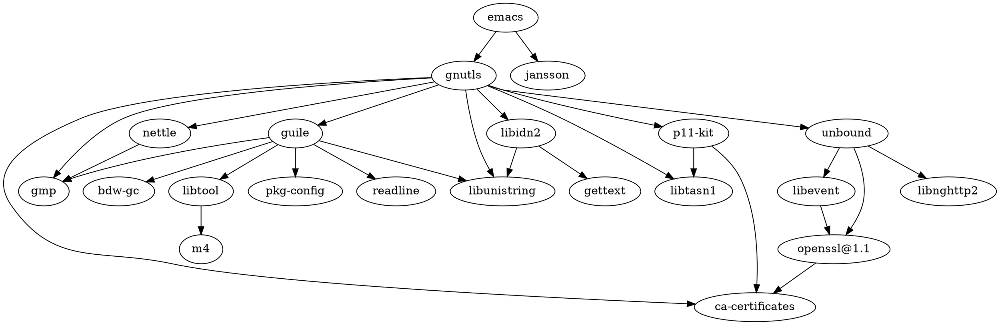

[[GNU]] Emacs [[编辑器]]，官网：[GNU Emacs - GNU Project](https://www.gnu.org/software/emacs/)
外号：神之编辑器

An extensible, customizable, free/libre text editor — and more.
At its core is an interpreter for [[Emacs Lisp]], a dialect of the Lisp programming language with extensions to support text editing.

[[Richard Stallman]]

org.gnu.Emacs

[Emacs is the 2D Command-line Interface – Hongchao's Notes](https://hongchao.me/cli-and-emacs/)

> [!NOTE] Emacs 核心缺点
>
> - Emacs Lisp 性能
> - 真の多线程支持
> - 图形绘制能力
>
> [manateelazycat.github.io/2022-10-03-emacs-rpc.md](https://github.com/manateelazycat/manateelazycat.github.io/blob/master/_posts/2022-10-03-emacs-rpc.md)


> Emacs was created before I born and most likely will be alive after I die.

[Contributing to Emacs](https://archive.casouri.cc/note/2020/contributing-to-emacs/)

## 功能

ELPA：[[Emacs Lisp]] Package Archive
[[Emacs 插件]]
[[Emacs 快捷键]]
[[文学编程]]
浮动窗口：child frame 对应 [[Neovim]] 中的 floatwindow
emacs-uptime

### Emacs 27

### Emacs 28

[Emacs 28 新特性介绍 – EmacsTalk](https://emacstalk.github.io/post/009/)

### Emacs 29

LSP: [[Eglot]]
[[tree-sitter]] 支持: C、C++、Java、CSS、JSON、C#、TypeScript
Profiles: `--init-directory`
[Emacs 29 目前适合作为日常生产力工具了么？ - Emacs China](https://emacs-china.org/t/emacs-29/21495/24?u=suliveevil)

## 界面

Frame：程序窗口/窗格/面板
Frame-Title
Menu bar：菜单栏
Toolbar：工具栏
Header-Line
Window：窗口
Buffer：缓冲区/编辑区域
Scroll bar：滚动条
Mode-line/Status bar：状态栏
Header-line：
Mini-buffer/Echo area：迷你缓冲区/回显区/交互区域，位于 Frame 底部

## 概念

[Glossary (GNU Emacs Manual)](https://www.gnu.org/software/emacs/manual/html_node/emacs/Glossary.html)
面板/窗格：Frame
子窗格：child frame
草稿缓冲区：Scratch Buffer
窗口：Window
光标/游标：Point/Cursor/Caret
标记：mark
缓冲区：Buffer
面板分割边缘：fringe
剪切/移除：Kill/cut
剪贴板历史：kill ring/clipboard history
迷你缓冲区/小缓冲：MiniBuffer，主命令行
命令缓冲区：Message Buffer
模式：Mode。主模式（Major Mode）、次模式/副模式（Minor Mode）
选区：region
粘贴/召回：Yank/paste
命令：Command
删除：Delete
回显区：Echo Area
文件：File
渐进式搜索：Incremental Search
插入：Insert
状态栏：Mode Line
数字参数：Numeric Argument
滚动：Scrolling
搜索：Search
撤销：Undo
重做：Redo
语法高亮：font locking/syntax highlight
字体：Font Face
主题：theme


## 内置模式

### major-mode

### minor-mode

winner-mode


## 发行版与安装

[GccEmacs 在各个平台上的安装 - Eason Huang](https://eason0210.github.io/post/install-gccemacs)


```shell
# 标准安装
# https://github.com/Homebrew/homebrew-core/blob/HEAD/Formula/emacs.rb
brew install emacs
# HEAD with option
brew install emacs --HEAD --use-git-head --with-cocoa --with-gnutls --with-rsvg --with-imagemagick
```

cask

Emacs：[GNU Emacs For Mac OS X](https://emacsformacosx.com/)
[caldwell/build-emacs](https://github.com/caldwell/build-emacs): Build scripts for www.emacsformacosx.com
https://github.com/Homebrew/homebrew-cask/blob/HEAD/Casks/emacs.rb




[jimeh/homebrew-emacs-builds](https://github.com/jimeh/homebrew-emacs-builds)

```shell
brew tap jimeh/emacs-builds
brew install --cask emacs-app
brew install --cask emacs-app-pretest
brew install --cask emacs-app-good
brew install --cask emacs-app-nightly
```

[[Emacs-plus]]

[[Emacs-mac]]

[[emacs-head]]

[The Emacs for the Mac · Aquamacs Emacs](https://aquamacs.org/)
[Aquamacs Emacs - GitHub](https://github.com/aquamacs-emacs/aquamacs-emacs)

[Emacs Modified for macOS | Vincent Goulet](https://vigou3.gitlab.io/emacs-modified-macos/)

Windows: [kiennq/emacs-build](https://github.com/kiennq/emacs-build): Scripts to build a distribution of Emacs from sources, using MSYS2 and Mingw64(32)

[Emacs on Macos for Linux Peeps – Random Thoughts](https://lars.ingebrigtsen.no/2020/08/02/emacs-on-macos-for-linux-peeps/)

[How To Build the Development Version of Emacs on Windows – Random Thoughts](https://lars.ingebrigtsen.no/2020/12/18/how-to-build-the-development-version-of-emacs-on-windows/)

## 启动/重启

随系统启动

```text
<?xml version="1.0" encoding="UTF-8"?>
 <!DOCTYPE plist PUBLIC "-//Apple//DTD PLIST 1.0//EN" "http://www.apple.com/DTDs/PropertyList-1.0.dtd">
 <plist version="1.0">
   <dict>
     <key>KeepAlive</key>
     <true/>
     <key>Label</key>
     <string>gnu.emacs.daemon</string>
     <key>ProgramArguments</key>
     <array>
       <string>/Applications/Emacs.app/Contents/MacOS/Emacs</string>
       <string>--daemon</string>
     </array>
     <key>RunAtLoad</key>
     <true/>
     <key>ServiceDescription</key>
     <string>GNU Emacs Daemon</string>
   </dict>
```

```shell
sudo launchctl load -w ~/Library/LaunchAgents/gnu.emacs.daemon.plist
```

[提高 emacs 启动速度至少 10%的技巧 - Emacs China](https://emacs-china.org/t/emacs-10/17716)

[[restart-emacs]]
启动参数

GUI
TUI
Daemon/Server: [DarwinAwardWinner/mac-pseudo-daemon](https://github.com/DarwinAwardWinner/mac-pseudo-daemon): Emacs daemon mode that plays nice with Mac OS.

## 插件

[[emacs-achievements]]


## [[Emacs 配置]]

[请问，你是如何使用 Emacs 的原生键位的？ - Emacs-general - Emacs China](https://emacs-china.org/t/emacs/21027)


打开大文件：需关闭 `linum-mode`

## 项目&组织&社区&用户

The Free Software Foundation [⎋](https://www.fsf.org/ "Homepage") (principal organisational sponsor of the GNU project)
The Org Project [⎋](https://orgmode.org/ "Homepage") (responsible for [org-mode](https://orgmode.org/ "project page"))
[[Emacsmirror]]
[[Emacs China]]: [emacs-china/blogroll](https://github.com/emacs-china/blogroll): Emacs China 搜集的周围朋友们的 Blog
[[EmacsWiki]]
[水木社区-Emacs 编辑器](https://www.mysmth.net/nForum/#!board/Emacs)
[Emacs Application Framework](https://github.com/emacs-eaf?type=source)
[Emacs Cask](https://github.com/cask/)
[BLEE](https://github.com/bx-blee?type=source): ByStar Libre-Halaal Emacs Environment
[manateelazycat.github.io/2019-05-12-emacs-hackers.md](https://github.com/manateelazycat/manateelazycat.github.io/blob/master/_posts/2019-05-12-emacs-hackers.md)

### 维护者

Eli Zaretskii
Stefan Monnier
John Wiegley
Yuan Fu


### 国际用户

[[Eric Raymond]] 《[[大教堂与集市]]》、《如何成为一名黑客》的作者
[[Linus Torvalds]] 使用的是自己定制的 uemacs
[[Richard Stallman]]
松本行弘：[[Ruby]]之父
Daniel Weinreb：Symbolics 公司创始人之一
Donald Knuth：[[TeX]]之父 [[计算机程序设计艺术]]作者
Guido van Rossum：[[Python]]之父
Guy Steele _C: A Reference Manual_ 的作者
Jamie Zawinski：Mozilla 和 XEmacs 主要贡献者之一
Joe Armstrong：编程语言 Erlang 的作者
Julian Assange：[[维基解密]]创始人
Marc Andreessen：网景公司创始人，Masic 浏览器的作者
Mark Zuckerberg：[[Facebook]] 创始人
Martin Fowler [[重构：改善既有代码的设计]]作者
Peter Norvig《人工智能：一种现代方法》的作者
Neal Stephenson
Richard Gabriel：文章 _Worse is Better_ 的作者
Marijn Haverbeke：《Eloquent JavaScript》的作者
Christopher Wellons：[[elfeed]] 作者
Steve Yegge
James Clark：[[nxml-mode]] 作者
Nicolas Petton：[[seq.el]] 作者
Vernor Vinge：
Jonas Bernoulli [@tarsius](https://github.com/tarsius "GitHub profile") (responsible for [Magit](https://github.com/tarsius/magit "project page"), [Transient](https://github.com/tarsius/transient "project page"), and others)
[Protesilaos Stavrou](https://protesilaos.com/) [@protesilaos](https://github.com/protesilaos "GitHub profile") (responsible for [Modus themes](https://git.sr.ht/~protesilaos/modus-themes "project page"), [Denote](https://git.sr.ht/~protesilaos/denote "project page"), and others)
Timothy [@tecosaur](https://github.com/tecosaur "GitHub profile")
Daniel Mendler [@minad](https://github.com/minad "GitHub profile") (responsible for [Consult](https://github.com/minad/consult "project page"), [Vertico](https://github.com/minad/vertico "project page"), [Corfu](https://github.com/minad/corfu "project page"), and other UI packages)
Henrik Lissner [@hlissner](https://github.com/hlissner "GitHub profile") (responsible for [Doom Emacs](https://github.com/doomemacs/doomemacs "project page"), and assorted packages)
Oleh Krehel [@abo-abo](https://github.com/abo-abo "GitHub profile") (responsible for [Swiper](https://github.com/abo-abo/swiper "project page"), [Hydra](https://github.com/abo-abo/hydra "project page"), [Avy](https://github.com/abo-abo/avy "project page"), and [Lispy](https://github.com/abo-abo/Lispy "project page"))
Vasilij Schneidermann [@wasamasa](https://github.com/wasamasa "GitHub profile") (responsible for [nov.el](https://depp.brause.cc/nov.el/ "project page"), [circe](https://github.com/emacs-circe/circe "project page"), [eyebrowse](https://depp.brause.cc/eyebrowse "project page"), and [shackle](https://depp.brause.cc/shackle "project page"))
Ivan Yonchovski [@yyoncho](https://github.com/yyoncho "GitHub profile") (responsible for [lsp-mode](https://github.com/emacs-lsp/lsp-mode "project page"), [dap-mode](https://github.com/emacs-lisp/dap-mode "project page"), and and other LSP things)
Nicholas Vollmer [@progfolio](https://github.com/progfolio "GitHub profile") (responsible for [Straight](https://github.com/radian-software/straight.el "project page"), [Elpaca](https://github.com/progfolio/elpaca "project page"), and [Doct](https://github.com/progfolio/doct "project page"))
[[stardiviner]]

### 中文用户

[[李杀]]
[[王勇]]
[[陈斌]]
[[刘家财]]
[[子龙山人]]
[[第 253 页图灵笔记]]
[baohaojun - 哔哩哔哩_bilibili](https://space.bilibili.com/19652426)
[KiteAB - 哔哩哔哩_bilibili](https://space.bilibili.com/387229912)
[无知的菜狗 - 哔哩哔哩_bilibili](https://space.bilibili.com/1281376)
[一杯玺茶 xt - 哔哩哔哩_bilibili](https://space.bilibili.com/11608450): [loveminimal/emacs.d](https://github.com/loveminimal/emacs.d)
[uppet (Joyer Huang)](https://github.com/uppet): [再一次，写一个最简单的.emacs - JoyerHuang_悦- CSDN 博客](https://blog.csdn.net/DelphiNew/article/details/6732295)
[gcclll (gcclll) / Repositories](https://github.com/gcclll?tab=repositories&type=source)

### 其他


## Debug

[Emacs 常用 debug 手段 - whatacold 的空间](https://whatacold.io/zh-cn/blog/2022-07-17-emacs-elisp-debug/)/[Emacs Debugging Basics - whatacold's space](https://whatacold.io/blog/2022-07-17-emacs-elisp-debug/)
[twlz0ne/emacsq-sh](https://github.com/twlz0ne/emacsq-sh): Helper script to run `emacs -Q`
[bug-debugging-and-debugger-and-also-edebug](http://incf19.com/yynotes/posts/2021-07-04-8-bug-debugging-and-debugger-and-also-edebug/index.html)

## 教程/文档/社区

[Emacs Tips and Tricks](https://www.jimmenard.com/emacs_tips.html)

[专业 Emacs 入门教程 - 知乎专栏](https://www.zhihu.com/column/c_1440829147212279808)

[EmacsWiki](https://www.emacswiki.org/)

[Planet Emacslife](https://planet.emacslife.com/)

[Emacs Docs](https://emacsdocs.org/): The modern documentation website Emacs deserves.

[Emacs Online Documentation](https://doc.endlessparentheses.com/)

[lujun9972/emacs-document](https://github.com/lujun9972/emacs-document): translate emacs documents to Chinese for convenient reference

[mostlymaths.net | The Emacs 30 Day Challenge](https://mostlymaths.net/2010/12/emacs-30-day-challenge.html/)

[Master Emacs in 21 Days](https://book.emacs-china.org/)

http://emacs.stackexchange.com

[Emacs and Lisp wiki - pengpengxp](https://pengpengxp.github.io/archive/before-2018-11-10/2017-06-19-my_emacs_and_lisp_wiki.html#orgd9b4982)

[Emacs Blog - 谢鹏/pengpengxp](https://pengpengxp.github.io/emacs/emacs_blog.html)

[pengpengxp/.emacs.d - GitHub](https://github.com/pengpengxp/.emacs.d)

## 视频


[Spacemacs ABC - Eivin Fonn - YouTube](https://github.com/TheBB)


[Using Emacs Series - C'est la Z（Mike Zamansky）](https://cestlaz.github.io/stories/emacs/)
[zamansky/dot-emacs - GitHub](https://github.com/zamansky/dot-emacs)
[zamansky/dot-emacs-videos-to-77](https://github.com/zamansky/dot-emacs-videos-to-77)
[Using Emacs - Mike Zamansky - YouTube](https://www.youtube.com/watch?v=49kBWM3RQQ8&list=PL9KxKa8NpFxIcNQa9js7dQQIHc81b0-Xg)
[Using Emacs - Mike Zamansky - 哔哩哔哩_bilibili](https://www.bilibili.com/video/av93384310/?p=1)

<iframe
		src="http://player.bilibili.com/player.html?aid=93384310&bvid=BV1fE411x7jc&cid=159434108&page=1"
		scrolling="no"
		border="0"
		frameborder="no"
		framespacing="0"
		allowfullscreen="true"
		style="height:100%;width:100%; aspect-ratio: 16 / 9;">
</iframe>


<iframe
		src="http://player.bilibili.com/player.html?aid=3376647&bvid=BV15s411o7Td&cid=5345655&page=1"
		scrolling="no"
		border="0"
		frameborder="no"
		framespacing="0"
		allowfullscreen="true"
		style="height:100%;width:100%; aspect-ratio: 16 / 9;">
</iframe>

## 书籍

Sam Teach Yourself Emacs in 24 Hours
[[Writing GNU Emacs Extensions]]
Emacs Field Guide
[[Mastering Emacs]]
Hacking your way around in Emacs
Emacs Lisp - An Introduction

## 生态

[[TeXmacs]]

## 联动

[Emacs: Open File in External App 🚀](http://xahlee.info/emacs/emacs/emacs_dired_open_file_in_ext_apps.html)

## Emacs elsewhere


[stsquad/emacs_chrome](https://github.com/stsquad/emacs_chrome): A Chromium "clone" of It's All Text for spawning an editor to edit text areas in browsers. Based on David Hilley's original Chromium extension.


## 竞品 app

[lem-project/lem](https://github.com/lem-project/lem): Common Lisp editor/IDE with high expansibility

[[Vim]]

[[Neovim]]

[[Kakoune]]

[[Visual Studio Code]]

[troglobit/mg](https://github.com/troglobit/mg): Micro (GNU) Emacs-like text editor ❤️ public-domain


## Misc

[EmacsConf](https://emacsconf.org/)

[Emacs Rocks!](https://emacsrocks.com/)

[jimeh/build-emacs-for-macos](https://github.com/jimeh/build-emacs-for-macos): Somewhat hacky script to automate building of Emac.app on [[macOS]].

[The Emacsmirror!](https://emacsmirror.net/)

[thomasluquet/emacs-can-do-that](https://github.com/thomasluquet/emacs-can-do-that): Yep, emacs can do that !

[Tags: Emacs 之怒 - 暗无天日](http://blog.lujun9972.win/tags/emacs%E4%B9%8B%E6%80%92/)

[如何加快 Emacs 的启动速度 - Emacs-general - Emacs China](https://emacs-china.org/t/emacs/15409/22)

[完美的 秒启动 Emacs - Emacs China](https://emacs-china.org/t/emacs/21184)

[我的 Lisp 经历和 GNU Emacs 的开发 - GNU 工程 - 自由软件基金会](https://www.gnu.org/gnu/rms-lisp.html)

[History of Emacs and vi Keys](http://xahlee.info/kbd/keyboard_hardware_and_key_choices.html)

[emacs 还能做什么？emacs 比 vim 好在哪里？ - 知乎](https://www.zhihu.com/question/21393299/answer/137479868)

https://news.ycombinator.com/item?id=25810427

[Use abbrev to Enter Special Characters - The Emacs Cat](https://olddeuteronomy.github.io/post/use-abbrev-to-enter-special-characters/)

[lem-project/lem](https://github.com/lem-project/lem): [[Common Lisp]] editor/IDE with high expansibility

[emacs-ng/emacs-ng](https://github.com/emacs-ng/emacs-ng): A new approach to Emacs - Including TypeScript, Threading, Async I/O, and WebRender.

[shugo/textbringer](https://github.com/shugo/textbringer): An Emacs-like text editor written in [[Ruby]]

[Eason0210/karabiner-config](https://github.com/Eason0210/karabiner-config): Personal [[Karabiner-Elements]] Configuration for MacBook Pro and Emacs

[有没有 Emacs 专用的键盘？ - Emacs China](https://emacs-china.org/t/emacs/20582)

### 文章

[LibrePlanet 2022: Living in freedom with GNU Emacs | Protesilaos Stavrou](https://protesilaos.com/codelog/2022-03-22-libreplanet-emacs-living-freedom/)

[30 岁文转码：我用了三年时间从哲学家变成知名软件项目核心开发 - 腾讯新闻](https://new.qq.com/rain/a/20220325A062ZS00)


