[daviderestivo/homebrew-emacs-head](https://github.com/daviderestivo/homebrew-emacs-head): GNU Emacs formula for the Homebrew package manager

## 依赖

```shell
brew graph daviderestivo/emacs-head/emacs-head@29
```

```dot
digraph G {
    "daviderestivo/emacs-head/emacs-head@29";
    "giflib";
    "gnutls";
    "ca-certificates";
    "gmp";
    "guile";
    "bdw-gc";
    "libtool";
    "m4";
    "libunistring";
    "pkg-config";
    "readline";
    "libidn2";
    "gettext";
    "libtasn1";
    "nettle";
    "p11-kit";
    "unbound";
    "libevent";
    "openssl@1.1";
    "libnghttp2";
    "imagemagick";
    "freetype";
    "libpng";
    "ghostscript";
    "fontconfig";
    "jbig2dec";
    "jpeg-turbo";
    "libidn";
    "libtiff";
    "little-cms2";
    "openjpeg";
    "libheif";
    "aom";
    "jpeg-xl";
    "brotli";
    "highway";
    "imath";
    "openexr";
    "webp";
    "libvmaf";
    "libde265";
    "shared-mime-info";
    "glib";
    "pcre2";
    "xmlto";
    "docbook";
    "docbook-xsl";
    "gnu-getopt";
    "x265";
    "liblqr";
    "libomp";
    "libraw";
    "jasper";
    "xz";
    "jansson";
    "librsvg";
    "cairo";
    "libx11";
    "libxcb";
    "libpthread-stubs";
    "libxau";
    "xorgproto";
    "libxdmcp";
    "libxext";
    "libxrender";
    "lzo";
    "pixman";
    "gdk-pixbuf";
    "pango";
    "fribidi";
    "harfbuzz";
    "graphite2";
    "icu4c";
    "libxml2";
    "daviderestivo/emacs-head/emacs-head@29" -> "giflib";
    "daviderestivo/emacs-head/emacs-head@29" -> "gnutls";
    "daviderestivo/emacs-head/emacs-head@29" -> "imagemagick@7";
    "daviderestivo/emacs-head/emacs-head@29" -> "jansson";
    "daviderestivo/emacs-head/emacs-head@29" -> "librsvg";
    "daviderestivo/emacs-head/emacs-head@29" -> "libxml2";
    "gnutls" -> "ca-certificates";
    "gnutls" -> "gmp";
    "gnutls" -> "guile";
    "gnutls" -> "libidn2";
    "gnutls" -> "libtasn1";
    "gnutls" -> "libunistring";
    "gnutls" -> "nettle";
    "gnutls" -> "p11-kit";
    "gnutls" -> "unbound";
    "guile" -> "bdw-gc";
    "guile" -> "gmp";
    "guile" -> "libtool";
    "guile" -> "libunistring";
    "guile" -> "pkg-config";
    "guile" -> "readline";
    "libtool" -> "m4";
    "libidn2" -> "gettext";
    "libidn2" -> "libunistring";
    "nettle" -> "gmp";
    "p11-kit" -> "ca-certificates";
    "p11-kit" -> "libtasn1";
    "unbound" -> "libevent";
    "unbound" -> "libnghttp2";
    "unbound" -> "openssl@1.1";
    "libevent" -> "openssl@1.1";
    "openssl@1.1" -> "ca-certificates";
    "imagemagick" -> "freetype";
    "imagemagick" -> "ghostscript";
    "imagemagick" -> "jpeg-turbo";
    "imagemagick" -> "libheif";
    "imagemagick" -> "liblqr";
    "imagemagick" -> "libomp";
    "imagemagick" -> "libpng";
    "imagemagick" -> "libraw";
    "imagemagick" -> "libtiff";
    "imagemagick" -> "libtool";
    "imagemagick" -> "little-cms2";
    "imagemagick" -> "openexr";
    "imagemagick" -> "openjpeg";
    "imagemagick" -> "webp";
    "imagemagick" -> "xz";
    "freetype" -> "libpng";
    "ghostscript" -> "fontconfig";
    "ghostscript" -> "freetype";
    "ghostscript" -> "jbig2dec";
    "ghostscript" -> "jpeg-turbo";
    "ghostscript" -> "libidn";
    "ghostscript" -> "libpng";
    "ghostscript" -> "libtiff";
    "ghostscript" -> "little-cms2";
    "ghostscript" -> "openjpeg";
    "fontconfig" -> "freetype";
    "libtiff" -> "jpeg-turbo";
    "little-cms2" -> "jpeg-turbo";
    "little-cms2" -> "libtiff";
    "openjpeg" -> "libpng";
    "openjpeg" -> "libtiff";
    "openjpeg" -> "little-cms2";
    "libheif" -> "aom";
    "libheif" -> "jpeg-turbo";
    "libheif" -> "libde265";
    "libheif" -> "libpng";
    "libheif" -> "shared-mime-info";
    "libheif" -> "x265";
    "aom" -> "jpeg-xl";
    "aom" -> "libvmaf";
    "jpeg-xl" -> "brotli";
    "jpeg-xl" -> "giflib";
    "jpeg-xl" -> "highway";
    "jpeg-xl" -> "imath";
    "jpeg-xl" -> "jpeg-turbo";
    "jpeg-xl" -> "libpng";
    "jpeg-xl" -> "openexr";
    "jpeg-xl" -> "webp";
    "openexr" -> "imath";
    "webp" -> "giflib";
    "webp" -> "jpeg-turbo";
    "webp" -> "libpng";
    "webp" -> "libtiff";
    "shared-mime-info" -> "gettext";
    "shared-mime-info" -> "glib";
    "shared-mime-info" -> "xmlto";
    "glib" -> "gettext";
    "glib" -> "pcre2";
    "xmlto" -> "docbook";
    "xmlto" -> "docbook-xsl";
    "xmlto" -> "gnu-getopt";
    "docbook-xsl" -> "docbook";
    "liblqr" -> "glib";
    "libraw" -> "jasper";
    "libraw" -> "jpeg-turbo";
    "libraw" -> "libomp";
    "libraw" -> "little-cms2";
    "jasper" -> "jpeg-turbo";
    "librsvg" -> "cairo";
    "librsvg" -> "gdk-pixbuf";
    "librsvg" -> "glib";
    "librsvg" -> "pango";
    "cairo" -> "fontconfig";
    "cairo" -> "freetype";
    "cairo" -> "glib";
    "cairo" -> "libpng";
    "cairo" -> "libx11";
    "cairo" -> "libxcb";
    "cairo" -> "libxext";
    "cairo" -> "libxrender";
    "cairo" -> "lzo";
    "cairo" -> "pixman";
    "libx11" -> "libxcb";
    "libx11" -> "xorgproto";
    "libxcb" -> "libpthread-stubs";
    "libxcb" -> "libxau";
    "libxcb" -> "libxdmcp";
    "libpthread-stubs" -> "pkg-config";
    "libxau" -> "xorgproto";
    "libxdmcp" -> "xorgproto";
    "libxext" -> "libx11";
    "libxext" -> "xorgproto";
    "libxrender" -> "libx11";
    "libxrender" -> "xorgproto";
    "gdk-pixbuf" -> "glib";
    "gdk-pixbuf" -> "jpeg-turbo";
    "gdk-pixbuf" -> "libpng";
    "gdk-pixbuf" -> "libtiff";
    "pango" -> "cairo";
    "pango" -> "fontconfig";
    "pango" -> "freetype";
    "pango" -> "fribidi";
    "pango" -> "glib";
    "pango" -> "harfbuzz";
    "harfbuzz" -> "cairo";
    "harfbuzz" -> "freetype";
    "harfbuzz" -> "glib";
    "harfbuzz" -> "graphite2";
    "harfbuzz" -> "icu4c";
    "libxml2" -> "icu4c";
    "libxml2" -> "readline";
}
```





## Misc

[[Emacs-plus]]

[[Emacs-mac]]

[daviderestivo/galactic-emacs](https://github.com/daviderestivo/galactic-emacs): A Emacs distribution coming from the space ...


