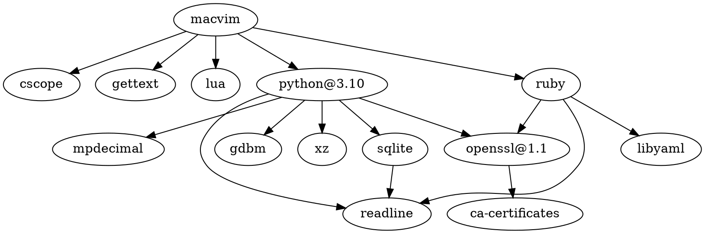

[macvim-dev/macvim](https://github.com/macvim-dev/macvim): [[Vim]] - the text editor

##  功能

[[URL Scheme]]：与 [[TextMate]] 兼容


## 依赖
cscope
gettext
[[Lua]]
[[Python]]
[[Ruby]]



## 冲突

Conflicts with: vim (because vim and macvim both install vi* binaries)

## 安装

```shell
brew install --cask macvim
```

## Misc


