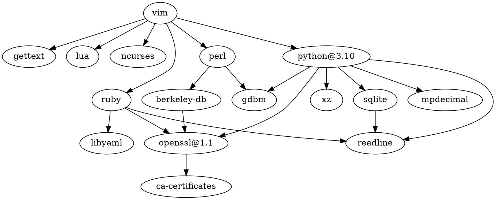

模式[[编辑器]]（Modal Editor），支持[[正则表达式]]，由 Bram Moolenaar 从 [[Unix]] 上的 ex、vi 发展而来。

[Vim: Seven habits of effective text editing](https://www.moolenaar.net/habits.html)
[vim/vim: The official Vim repository](https://github.com/vim/vim)

特性集：tiny、small、normal、big、huge

## 概念


补全：Completion，Omni Completion、用户自定义补全
改动历史：tree，每次改动都是树的一个节点，和 Git 中的 branch 十分类似。
临时文件：backup 备份文件、swap 交换文件、undo 撤销文件、viminfo 文件
事件
Argument：参数
AutoCommand：自动命令
Buffer：缓冲区，分类：已激活、已载入、已列出、已命名、未命名、临时、隐藏
Cursor：光标
[[Vim Events]]
Fold：折叠，类型：diff、expr、indent、manual、marker、syntax
Highlight：颜色主题/高亮
Job：任务
Map：映射（快捷键）
Mark：标注
Mouse：鼠标
Range：范围，可以是一个数字或者一对以`,`或`;`分隔的行号
Session/View：会话，类似操作系统快照
Tabpage：标签页
Window：窗口

## 功能
[[宏]]：Macro
[[文本对象]]
[[正则表达式]]
[[Vimscript]]
[[Vim 插件]]
[[Vim 快捷键]]：寄存器、模式编辑：[[模式]]、[[操作符]]、[[动作]]、[[文本对象]]
[ghewgill/vim-scmdiff](https://github.com/ghewgill/vim-scmdiff): Vim script to highlight lines changed from a base version in SCM

## 文件夹


viminfo
backup
swap
view
undo

## 启动选项

在 `nocompatible` 模式下，不引用 `vimrc` 的情况下启动 Vim

```shell
vim -u NONE -N
```

## 书籍

Vim 101 Hacks

*Learning the vi and Vim Editors*


## 技巧/学习

*Learn Vim for the Last Time* - Daniel Miessler

[Vim Tutorial for Beginners - YouTube](https://www.youtube.com/watch?time_continue=189&v=RZ4p-saaQkc&feature=emb_logo)

[Vim Tips Wiki | Fandom](https://vim.fandom.com/wiki/Vim_Tips_Wiki)

[[vim-tips]]

[Interactive Vim tutorial](https://www.openvim.com/)

[wincent/vim-university: A curriculum for leveling up your Vim](https://github.com/wincent/vim-university)

[Your problem with **Vim** is that you don't grok **vi** - Stack Overflow](https://stackoverflow.com/a/1220118/9230786)

[Beautiful Vim Cheat Sheet](https://www.vimcheatsheet.com/)

[Vim Cheat Sheet](https://vim.rtorr.com/)

Vim 提权保存

```vim
:w !sudo tee % > /dev/null
```

[【译】强大的文件差异比较 - MacPlay](https://macplay.github.io/posts/the-power-of-diff/)

### get character under/ahead cursor(pre-cursor)

https://stackoverflow.com/a/64981366

```vimscript
matchstr(getline('.'), '\%' . col('.') . 'c.')
```


```vimscript
function! CharAtIdx(str, idx) abort
  " Get char at idx from str. Note that this is based on character index
  " instead of the byte index.
  return strcharpart(a:str, a:idx, 1)
endfunction
                                                                          
function! CursorCharIdx() abort
  " A more concise way to get character index under cursor.
  let cursor_byte_idx = col('.')
  if cursor_byte_idx == 1
    return 0
  endif
                             
  let pre_cursor_text = getline('.')[:col('.')-2]
  return strchars(pre_cursor_text)
endfunction

let cur_char_idx = CursorCharIdx()
let cur_char = CharAtIdx(getline('.'), cur_char_idx)

```

### 鼠标右键菜单


```vimscript
func s:MouseConfig()
	set mouse=a
	set mousemodel=popup_setpos
	" you can define menu self
	" visual model
	vnoremenu PopUp.Yank\ Text "+y
	vnoremenu PopUp.Cut\ Text "+d
	vnoremenu PopUp.Del\ Text "_d
	" normal model
	nnoremenu PopUp.Paste\ Text "+p
	nnoremenu PopUp.Select\ All ggVG
	nnoremenu PopUp.Back\ Pos <c-o>zz<cr>
	nnoremenu PopUp.Next\ Pos <c-i>zz<cr>
	nnoremenu PopUp.Back\ Buf :bp<cr>
	nnoremenu PopUp.Next\ Buf :bn<cr>
	nnoremenu PopUp.-Sep- :<cr>
	nnoremenu PopUp.Close\ Mouse :set mouse=""<cr>
endfunc
```


### vim keystroke log raw

  
十六进制文件

```shell

alias v='if [ -f .vimrc ]; then nvim -u .vimrc -w $HOME/vim-keystroke-log.txt; else nvim -u ~/.vimrc; fi'

```

[dyng/hexfilter](https://github.com/dyng/hexfilter): Read/Write non-printable characters in a printable way.


## App

[[MacVim]]


[[Android]]：[[DroidVim]]


[[WebAssembly]]：[rhysd/vim.wasm](https://github.com/rhysd/vim.wasm)

### Vim on iPadOS

iVim：App Store 免费 App，自带 Python

a-Shell：App Store 免费 App，自带 Python 等

iSH：虚拟机 Alpine Linux

BufferEditor：有一些基本的 Vim 模式


## 依赖

[[gettext]]
[[Lua]]
[[ncurses]]
[[Perl]]
[[Python]]
[[Ruby]]


[lee-shun/pure_vim](https://github.com/lee-shun/pure_vim): This is a pure vim script vim configuration trying to minimize the dependencies.




## 版本

```shell
VIM - Vi IMproved 9.0 (2022 Jun 28, 编译于 Sep 15 2022 19:27:32)
macOS 版本 - arm64
包含补丁: 1-472
编译者 GitHub Actions
巨型版本 带 MacVim 图形界面。  可使用(+)与不可使用(-)的功能:
+acl               +find_in_path      +mouse_xterm       -tcl
+arabic            +float             +multi_byte        +termguicolors
+autocmd           +folding           +multi_lang        +terminal
+autochdir         -footer            -mzscheme          +terminfo
-autoservername    +fork()            +netbeans_intg     +termresponse
+balloon_eval      +fullscreen        +num64             +textobjects
+balloon_eval_term +gettext           +odbeditor         +textprop
+browse            -hangul_input      +packages          +timers
++builtin_terms    +iconv             +path_extra        +title
+byte_offset       +insert_expand     +perl/dyn          +toolbar
+channel           +ipv6              +persistent_undo   +transparency
+cindent           +job               +popupwin          +user_commands
+clientserver      +jumplist          +postscript        +vartabs
+clipboard         +keymap            +printer           +vertsplit
+cmdline_compl     +lambda            +profile           +vim9script
+cmdline_hist      +langmap           +python/dyn        +viminfo
+cmdline_info      +libcall           +python3/dyn       +virtualedit
+comments          +linebreak         +quickfix          +visual
+conceal           +lispindent        +reltime           +visualextra
+cryptv            +listcmds          +rightleft         +vreplace
+cscope            +localmap          +ruby/dyn          +wildignore
+cursorbind        +lua/dyn           +scrollbind        +wildmenu
+cursorshape       +menu              +signs             +windows
+dialog_con_gui    +mksession         +smartindent       +writebackup
+diff              +modify_fname      +sodium            -X11
+digraphs          +mouse             -sound             -xfontset
+dnd               +mouseshape        +spell             +xim
-ebcdic            +mouse_dec         +startuptime       -xpm
+emacs_tags        -mouse_gpm         +statusline        -xsmp
+eval              -mouse_jsbterm     -sun_workshop      -xterm_clipboard
+ex_extra          +mouse_netterm     +syntax            -xterm_save
+extra_search      +mouse_sgr         +tag_binary
-farsi             -mouse_sysmouse    -tag_old_static
+file_in_path      +mouse_urxvt       -tag_any_white
     系统 vimrc 文件: "$VIM/vimrc"
     用户 vimrc 文件: "$HOME/.vimrc"
 第二用户 vimrc 文件: "~/.vim/vimrc"
      用户 exrc 文件: "$HOME/.exrc"
    系统 gvimrc 文件: "$VIM/gvimrc"
    用户 gvimrc 文件: "$HOME/.gvimrc"
第二用户 gvimrc 文件: "~/.vim/gvimrc"
       defaults 文件: "$VIMRUNTIME/defaults.vim"
        系统菜单文件: "$VIMRUNTIME/menu.vim"
         $VIM 预设值: "/Applications/MacVim.app/Contents/Resources/vim"
编译方式: clang -c -I. -Iproto -DHAVE_CONFIG_H -DFEAT_GUI_MACVIM -Wall -Wno-unknown-pragmas -pipe -DMACOS_X -DMACOS_X_DARWIN -g -O2 -arch x86_64 -arch arm64 -I/usr/local/Cellar/libsodium/1.0.18_1/include -D_REENTRANT -U_FORTIFY_SOURCE -D_FORTIFY_SOURCE=1 -Wall -Wextra -Wshadow -Werror -Wno-error=missing-field-initializers -Wno-error=deprecated-declarations -Wno-error=unused-function
链接方式: clang -L. -fstack-protector-strong -L/usr/local/lib -L/usr/local/opt/libyaml/lib -L/usr/local/opt/openssl@1.1/lib -L/usr/local/opt/readline/lib -L. -fstack-protector-strong -L/usr/local/lib -L/usr/local/opt/libyaml/lib -L/usr/local/opt/openssl@1.1/lib -L/usr/local/opt/readline/lib -arch x86_64 -arch arm64 -L/usr/local/lib -o Vim -lm -lncurses /usr/local/lib/libsodium.a -liconv /usr/local/lib/libintl.a -framework AppKit -fstack-protector -L/System/Library/Perl/5.18/darwin-thread-multi-2level/CORE
```


## 配置/发行版

[Vim Minimalist - Jinhua Luo Blog](http://luajit.io/post/2022/vim-minimalist/)

[[SpaceVim]]

[[space-vim]]

[[vim-iced]]

### 无插件

[wklken/vim-for-server](https://github.com/wklken/vim-for-server): .vimrc, simple configures for server, without plugins.

[mb6ockatf/cute-vimrc](https://github.com/mb6ockatf/cute-vimrc): A minimal .vimrc file which makes Vim look great without plugins

[nvim-zh/minimal_vim](https://github.com/nvim-zh/minimal_vim): A minimal Vim/Nvim configuration in just one file without external dependencies.


## 用户

[Dr Chip's Vim Page](http://www.drchip.org/astronaut/vim/index.html)


[inkarkat (Ingo Karkat)](https://github.com/inkarkat)

[lacygoill](https://github.com/lacygoill)

## Vim elsewhere

[[emacs-evil]]
Safari 插件：[[Vimari]]
macOS 系统增强：[[Vimac]]、[[SketchyVim]]
[godbout/kindaVim.theapp](https://github.com/godbout/kindaVim.theapp): Vim moves for the whole macOS. input fields and non-input fields. the blah blah.
[vifm/vifm](https://github.com/vifm/vifm): Vifm is a file manager with curses interface, which provides Vim-like environment for managing objects within file systems, extended with some useful ideas from mutt.
[[VSCodeVim]]
[XVimProject/XVim2](https://github.com/XVimProject/XVim2): Vim key-bindings for Xcode 9
JetBrains：IntelliJ Platform IDE：[[IdeaVim]]
[[ExcelLikeVim]]

[firemakergk/vimouse](https://github.com/firemakergk/vimouse): 让你在键盘上使用vim键位直接操纵鼠标。Control mouse with vim hot keys.

[goreliu/vimdesktop](https://github.com/goreliu/vimdesktop): 让所有 Windows 桌面程序拥有 Vim 操作风格的辅助工具

[einsxiao/GlobalVim](https://github.com/einsxiao/GlobalVim): GlobalVim provides keyboard layer for vim simulation all across the system. GeeKey provides keyboard customization and programming.


## 竞品 app

[[Neovim]]

[[Emacs]]

[vile](https://savannah.nongnu.org/projects/vile/): a vi-compatible text editor

[martanne/vis](https://github.com/martanne/vis): A vi-like editor based on Plan 9's structural regular expressions

[[Kakoune]]


## Misc

[[Vim 插件]]

[[Vim 配置]]

[[vimcdoc]]：中文帮助文档

[vimcolorschemes/vimcolorschemes](https://github.com/vimcolorschemes/vimcolorschemes): Find the best vim color schemes around


[AshleyF/VimSpeak](https://github.com/AshleyF/VimSpeak): Speak to your editor.
[jtjanecek/vims_only_voice](https://github.com/jtjanecek/vims_only_voice): A simple vim setup for Dragon Naturally Speaking voice commands.
[moreutils](https://joeyh.name/code/moreutils/)
[nathangrigg/vimhelppdf](https://github.com/nathangrigg/vimhelppdf): Create hyperlinked PDF file of the vim help documents
[nbeaver/vim-help-file](https://github.com/nbeaver/vim-help-file)
[pafcu/vimsplain](https://github.com/pafcu/Vimsplain): Explain Vim command sequences

[td0m/q](https://github.com/td0m/q): Optimising Vim keystroke usage since 1991, this time with machine learning.
[mhinz/vim-galore: All things Vim!](https://github.com/mhinz/vim-galore)
[tracyone/vim-cn](https://github.com/tracyone/vim-cn): 😎vimer from main-land CHINA
[yyq123/learn-vim](https://github.com/yyq123/learn-vim): 无废话极简版Vim学习笔记！文章按主题分拆为多个章节，并尽量控制每节的信息量；通过文字色彩和字体，将命令、快捷键突出显示；在每节结尾，提供一个命令列表，以便回顾文中介绍的重要命令。如果这些文章能对喜欢Vim的朋友有所益处，我将不胜荣幸。

[dofy/learn-vim: Vim 实操教程（Learning Vim）Vim practical tutorial.](https://github.com/dofy/learn-vim)

[oldratlee/vim-practice](https://github.com/oldratlee/vim-practice): 💘 Vim is awesome! Here is my practice and study log.

[iggredible/Learn-Vim: Learning Vim and Vimscript doesn't have to be hard. This is the guide that you're looking for 📖](https://github.com/iggredible/Learn-Vim)
[wsdjeg/Learn-Vim_zh_cn](https://github.com/wsdjeg/Learn-Vim_zh_cn)

[phantomdiorama/writingvim](https://github.com/phantomdiorama/writingvim): An awesome-ish list of vim for writers

