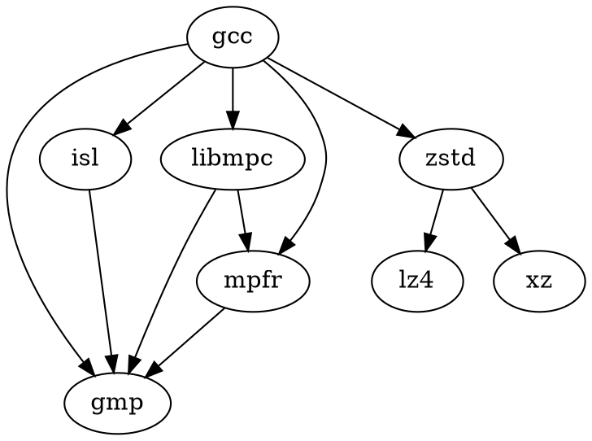

## 依赖

```dot
digraph G {
    "gcc";
    "gmp";
    "isl";
    "libmpc";
    "mpfr";
    "zstd";
    "lz4";
    "xz";
    "gcc" -> "gmp";
    "gcc" -> "isl";
    "gcc" -> "libmpc";
    "gcc" -> "mpfr";
    "gcc" -> "zstd";
    "isl" -> "gmp";
    "libmpc" -> "gmp";
    "libmpc" -> "mpfr";
    "mpfr" -> "gmp";
    "zstd" -> "lz4";
    "zstd" -> "xz";
}
```

## 竞品

[[LLVM]]

[[clang]]

## Misc

