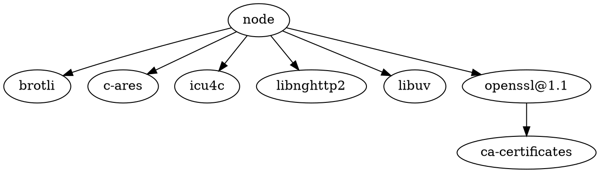

[Node.js](https://nodejs.org/en/)：Node.js® is a [[JavaScript]] runtime built on [[Google Chrome]]'s [V8 JavaScript engine](https://v8.dev/).

## 依赖

## 包管理器

NPM：Node package manager
Yarn：[yarnpkg/berry: 📦🐈 Active development trunk for Yarn ⚒](https://github.com/yarnpkg/berry)
pnPm：[pnpm/pnpm](https://github.com/pnpm/pnpm): Fast, disk space efficient package manager -- 快速的，节省磁盘空间的包管理工具

## 竞品

[[Deno]]

## Misc

[OpenJS Foundation](https://openjsf.org/)

