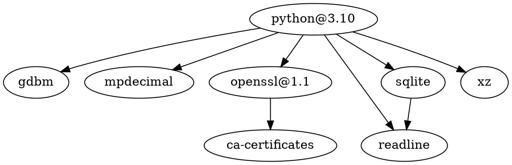

[Python Documentation](https://docs.python.org)


## 安装

官网安装
[[Homebrew]]：

```shell
brew isntall python3
```


## LSP

[python-lsp/python-lsp-server](https://github.com/python-lsp/python-lsp-server): Fork of the python-language-server project, maintained by the Spyder IDE team and the community

## API

[hpyproject/hpy](https://github.com/hpyproject/hpy): HPy: a better API for Python

## [[包管理器]]

pip：Package Installer for Python
[[pipx]]
[Comparison to Other Tools - pipx](https://pypa.github.io/pipx/comparisons/)

[python-poetry/poetry](https://github.com/python-poetry/poetry): Python packaging and dependency management made easy


### Python包/库[[依赖]]管理

```shell
# 导出
pip3 freeze > requirements.txt
# 导入
pip3 install -r requirements.txt
```


[[pipdot]]

[pypa/pip-audit](https://github.com/pypa/pip-audit): Audits Python environments and dependency trees for known vulnerabilities

[thebjorn/pydeps](https://github.com/thebjorn/pydeps): Python Module Dependency graphs


## 依赖

[[SQLite]]





## [[解释器]]

CPython：Python 官方解释器，使用 [[C]] 开发。
IPython：基于 CPython 的交互式解释器。
PyPy：使用 JIT 技术进行动态编译。
[RustPython/RustPython](https://github.com/RustPython/RustPython): A Python Interpreter written in [[Rust]]

## 语法

缩进
注释
条件判断
循环
函数
[[参数]]
变量
生成器Generator
迭代器Iterator


## 数据类型
整数
浮点数
[[字符串]]、[[占位符]]
布尔值
空值
变量
列表：list，可变有序集合
元组：tuple，不可变有序集合
字典：dict/map，键值对

## 操作符

```python
-
-=
!=
*
**
**=
*=
/
//
//=
/=
&
%
%=
^
+
->
+=
<
<<
<=
<>
=
:=
==
>
>=
>>
|
~
and
in
is
not
or
```


## 关键字

```python
as
assert
async
await
break
class
continue
def
del
elif
else
except
exec
finally
for
from
global
if
import
lambda
nonlocal
pass
print
raise
return
try
while
with
yield
match
case
```


## 函数

```python
abs
all
any
ascii
bin
bool
breakpoint
bytearray
bytes
callable
chr
classmethod
compile
complex
delattr
dict
dir
divmod
enumerate
eval
exec
filter
float
format
frozenset
getattr
globals
hasattr
hash
help
hex
id
input
int
isinstance
issubclass
iter
len
list
locals
map
max
memoryview
min
next
object
oct
open
ord
pow
print
property
range
repr
reversed
round
set
setattr
slice
sorted
staticmethod
str
sum
super
tuple
type
vars
zip
__import__
```


## 库

数据处理
文件处理
图像处理
游戏和多媒体
大数据和科学计算
人工智能与机器学习
系统与命令行
数据库
网络
Web 框架
安全
GUI
构建封装
代码调试

[哪些 Python 库让你相见恨晚？ - 知乎](https://www.zhihu.com/question/24590883)

## [[IDE]]

[[Geany]]
[[PyCharm]]
[[Thonny]]

## [[编辑器]]

[[Vim]]

[[Neovim]]

[[Emacs]]

[[Visual Studio Code]]


## Linter


[charliermarsh/ruff](https://github.com/charliermarsh/ruff): An extremely fast Python linter, written in [[Rust]].


## 书籍

Data Structure and Algorithms in Python

Python Crash Course

Python 核心编程

## 小脚本

[geekcomputers/Python](https://github.com/geekcomputers/Python)

## Misc

[Python is Actually Portable](https://ahgamut.github.io/2021/07/13/ape-python/)

[satwikkansal/wtfpython](https://github.com/satwikkansal/wtfpython): What the fuck Python? 😱

[jackzhenguo/python-small-examples](https://github.com/jackzhenguo/python-small-examples): 告别枯燥，致力于打造 Python 实用小例子，更多Python良心教程见 [Python中文网](http://www.zglg.work)

[[编程语言]]

[Episode #128: Using a Memory Profiler in Python & What It Can Teach You – The Real Python Podcast](https://realpython.com/podcasts/rpp/128/?utm_source=notification_summary&utm_medium=email&utm_campaign=2022-10-07)

[bloomberg/memray](https://github.com/bloomberg/memray): Memray is a memory profiler for Python

[alexmojaki/heartrate](https://github.com/alexmojaki/heartrate): Simple real time visualisation of the execution of a Python program.

[[PyXA]]

[Python小工具：监视函数运行资源的装饰器 - 知乎](https://zhuanlan.zhihu.com/p/438875473)

[Python计算函数执行时间（五种案例）_風の住む街~的博客-CSDN博客](https://blog.csdn.net/weixin_38924500/article/details/111679503)

[gaogaotiantian/viztracer](https://github.com/gaogaotiantian/viztracer): VizTracer is a low-overhead logging/debugging/profiling tool that can trace and visualize your python code execution.


[caleb531/alfred-workflow-packager](https://github.com/caleb531/alfred-workflow-packager): A command-line utility for packaging and exporting [[Alfred]] workflows with ease

```shell
pip install alfred-workflow-packager
```


[caleb531/imessage-conversation-analyzer](https://github.com/caleb531/imessage-conversation-analyzer): Gathers metrics of your choice for the entire history of a [[macOS]] Messages conversation


[srossross/Meta](https://github.com/srossross/Meta): Python Meta Programming

[gto76/python-cheatsheet](https://github.com/gto76/python-cheatsheet): Comprehensive Python Cheatsheet

Tkinter Designer

[mountaniol/fuf](https://github.com/mountaniol/fuf): Find Unused Function - find unused in a project

[PCMan/python-find-unused-func](https://github.com/PCMan/python-find-unused-func): Small tool to find unused function for python code

[boarnasia/genuuml](https://github.com/boarnasia/genuuml): [[PlantUML]] generator from python script

[[爬虫]]


如何给 Python 代码正确测速：
pip3 install richdb
from richdb import Time
用这个函数，Time.clock()，这个是计算使用的CPU时钟数，而不是时间，时间会因为CPU被其他进程占用而不准确和抖动，这个类把python不同版本的记录CPU时钟数的方法都统一了，用起来比较方便。


