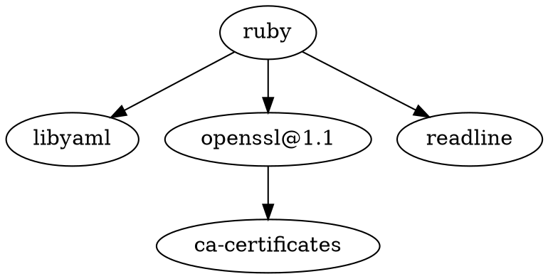

包管理器：Gem

## 依赖

```dot
digraph G {
    "ruby";
    "libyaml";
    "openssl@1.1";
    "ca-certificates";
    "readline";
    "ruby" -> "libyaml";
    "ruby" -> "openssl@1.1";
    "ruby" -> "readline";
    "openssl@1.1" -> "ca-certificates";
}
```

## 包管理器

[rubygems/rubygems](https://github.com/rubygems/rubygems): Library packaging and distribution for Ruby.

## Misc

[[Lisp]]

[[Python]]

