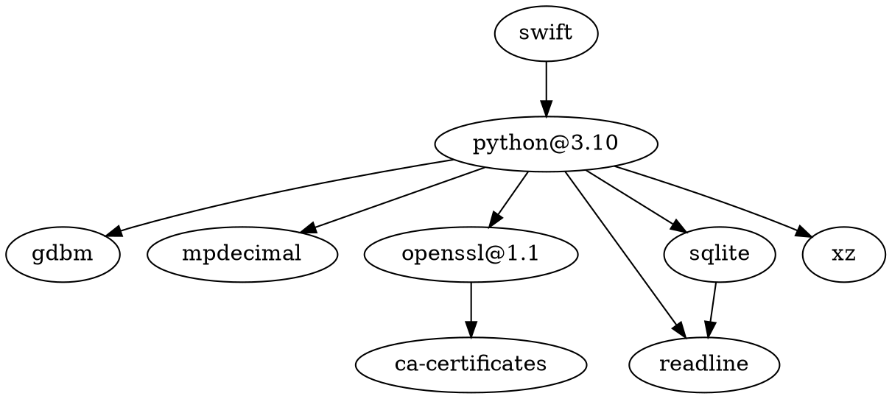

官网：[Swift.org](https://www.swift.org/)

官方论坛：[Swift | Apple Developer Forums](https://developer.apple.com/forums/tags/swift)

GitHub：[apple/swift](https://github.com/apple/swift): The Swift Programming Language

文档：[[The Swift Programming Language]]

## 依赖

## LSP

[[sourcekit-lsp]]

[[lsp-sourcekit]]

## 包管理器

SPM（Swift Package Manager）：[Swift.org - Package Manager](https://www.swift.org/package-manager/)

[yonaskolb/Mint](https://github.com/yonaskolb/Mint): A package manager that installs and runs executable Swift packages

## 教程

[斯坦福 CS193P Swift 开发教程](https://cs193p.sites.stanford.edu/)

chaocode - YouTube

designcode

hackingwithswift

[iOS & Swift Books | Kodeco, the new raywenderlich.com](https://www.kodeco.com/ios/books)

[ming1016/SwiftPamphletApp](https://github.com/ming1016/SwiftPamphletApp): 戴铭的开发小册子，一本活的开发手册。使用 SwiftUI + Combine + Swift Concurrency Aysnc/Await Actor + GitHub API 开发的 macOS 应用

[apple/sample-food-truck](https://github.com/apple/sample-food-truck): SwiftUI sample code from WWDC22

[Hacking with Swift – learn to code iPhone and iPad apps with free Swift tutorials](https://www.hackingwithswift.com/)

## Misc

[ChimeHQ/SwiftTreeSitter](https://github.com/ChimeHQ/SwiftTreeSitter): Swift API for the [[tree-sitter]] incremental parsing system

[stackotter/swift-bundler](https://github.com/stackotter/swift-bundler): An Xcodeproj-less tool for creating cross-platform Swift apps.

[apple/sourcekit-lsp](https://github.com/apple/sourcekit-lsp): Language Server Protocol implementation for Swift and C-based languages

[[vscode-swift]]

Swiftify：转换 Object-C 为 Swift 代码

> This tool is a godsend. Apple should buy it and roll it into Xcode.

[adam-fowler/swift-dependency-graph](https://github.com/adam-fowler/swift-dependency-graph): Visualisation of swift package dependencies

[[Objective-C]]
[[Objective-C++]]
[Swift macOS](https://gavinw.me/swift-macos/)
CocoaPods

